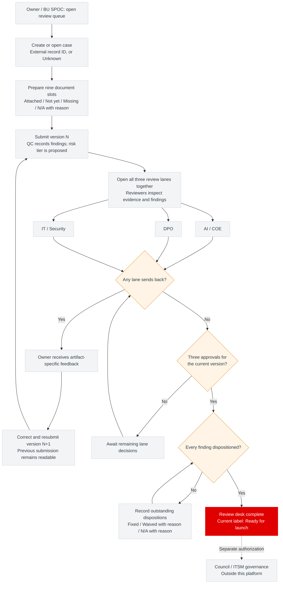

# RAI Workflow Platform PoC

**Working product name: RAI web. Status: design and synthetic demo complete; G0 closed 2026-09-21; product build authorized for W0-W3 on synthetic data. Production release remains gated.**

A review desk for one submitted AI-use-case pack, with parallel AI/COE, DPO and IT/Security review, versioned send-back and soft document QC. This is not True's official AI register and does not operate the eight-stage AI lifecycle.

## Product and build anchors

- **[PRD.md](PRD.md)** — problem, users, scope, requirements and success criteria.
- **[BUILD_PLAN.md](BUILD_PLAN.md)** — ordered work packages, dependencies, deliverables and evidence required to finish each one.

- **[docs/delivery/](docs/delivery/README.md)** — delegation pack: decision briefs, team roles, W0 contract and W1-W3 tickets. Planning only.
- **[docs/board/](docs/board/README.md)** — append-only build board: one stream per lane, claim before working.

These are the starting points for the future app build. The plan under changes/2026-09-20-documentation-foundation covers repository setup only.

## Workflow design

Start with the [interactive design handoff](docs/design/DEVELOPER_HANDOFF.md), [browser test evidence](docs/design/TEST_RUNS.md), and [Claude Design artifact](https://claude.ai/artifact/25FPuPyj6aczLrXca3P9Mz) (owner-private). The [workflow and card brief](docs/design/WORKFLOW_DESIGN.md) anchors the journeys. The matching local demonstrator is available in [demo/](demo/README.md); the product build is authorized for W0-W3 on synthetic data (D03) and production release remains gated (W8, D10).

## User journey

One document pack goes through three parallel reviews. Corrections create a new version; completion requires all three current-version approvals and a recorded disposition for every finding.

The decision diamonds summarize the combined case state; each lane can decide independently without waiting for the others. Finding dispositions may be recorded during review, not only after the third approval.

- **Parallel review:** all three lanes open, including for High-risk cases. High-risk Council confirmation remains external; it is not automatically granted by this flow.
- **Soft QC:** checks run on artifact attachment, submission and approval attempts. Findings do not prevent submission or lane approval, but must be dispositioned before desk completion. The demo also requires an evidence reference before a finding can be marked fixed; that is a demo assumption, not a source rule, and D05 (recorded 2026-09-21) did not adopt it: the product needs only the owning lane's confirmation of the owner's proposed "fixed". Do not port the demo rule.
- **Correction loop:** the demo resets approvals on resubmission and requires all three lanes to review the new version. Production applies the same rule under D05: full re-review, merged successor drafts, owning-lane dispositions and no self-approval.
- **Notifications:** the intended product sends links back to the case. The demo only previews notifications; email is not the approval record.
- **Completion:** the current label is “Ready for launch,” meaning review-desk completion only. “Review complete” is a suggested future label, not an approved change.

The local demo uses synthetic attachments, simulated QC/risk and a role switcher. It does not implement authentication, real uploads, email delivery or persistence. Admin configuration supports the journey but does not grant lane-approval authority.

Sources: [product requirements](PRD.md), [authoritative v1 rules](docs/product/source-spec.md), [verified demo journeys](changes/2026-09-21-local-design-demo/functional-gate.md), and the [decision register (recorded and open)](docs/product/decisions.md).

## Supporting contracts

1. Read the [v1 source specification](docs/product/source-spec.md) and the [decision register (recorded and open)](docs/product/decisions.md).
2. Follow the [workflow](docs/product/workflow.md), [data contract](docs/product/data-contract.md) and [planned architecture](docs/architecture/README.md).
3. Review [acceptance criteria](docs/acceptance.md), [QC evaluation](docs/evaluation/plan.md) and [threat model](docs/security/threat-model.md).
4. Build from [BUILD_PLAN](BUILD_PLAN.md) and the [delivery pack](docs/delivery/README.md); W0-W3 are authorized under D03 (see Build status below). The [implementation plan](docs/implementation-plan.md) is a pointer kept for old links.

## Repository map

| Path | Purpose |
|---|---|
| [AGENTS.md](AGENTS.md) | Agent authority and context |
| [DEVLOG.md](DEVLOG.md), [CHANGELOG.md](CHANGELOG.md) | Current state and change history |
| [TESTING.md](TESTING.md) | Documentation checks now; runtime gates later |
| [CONTRIBUTING.md](CONTRIBUTING.md), [SECURITY.md](SECURITY.md) | Change and security handling |
| [docs/sources.md](docs/sources.md) | Source identity, hashes and precedence |
| [docs/engineering/adoption.md](docs/engineering/adoption.md) | Pinned playbook and adoption gaps |
| [adr/README.md](adr/README.md) | Architecture decisions |
| [changes/2026-09-20-documentation-foundation/intent.md](changes/2026-09-20-documentation-foundation/intent.md) | Intent, spec, plan and verification trail |

Run the local design with `python3 demo/serve.py`, then open http://127.0.0.1:5173/. See the [demo PRD](changes/2026-09-21-local-design-demo/PRD.md), [demo plan](changes/2026-09-21-local-design-demo/plan.md) and [verification report](changes/2026-09-21-local-design-demo/review.md). Production stack, model provider, database and hosting decisions remain open.

## Build status

G0 closed on 2026-09-21: Nakhun confirmed the review-desk scope, the operator role and the DPO SLA (D01); Ta set the AI/COE mapping (D02), the workflow rules (D05), the calendar and notification policy (D06), the group and stage fields (D11), the language (D12) and authorized W0-W3 (D03). The [decision register](docs/product/decisions.md) has the exact answers. Next step is W0: the [technical contract](docs/delivery/w0-technical-contract.md), starting with the stack ADR (D04).

Production identity is True AD/Entra on True's network; any Google account is allowed only on localhost. A networked test deployment needs an allow-list or AD. Ready for launch means review-desk completion only; it is not Council approval or an ITSM deployment authorization.
