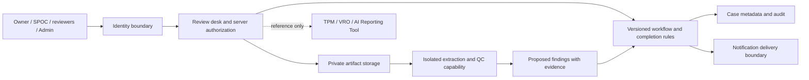

# Planned architecture

Status: conceptual; no service, language, framework, model or hosting selected.

## Boundaries

Identity adapter normalizes verified subject and roles; server authorization checks scope for every action. Google localhost and production AD are separate configurations. Review workflow owns state, human decisions, idempotency and the final readiness predicate. Model output never authorizes a transition.

Artifact storage owns protected bytes and stable version references. Extraction/QC consumes only authorized evidence and returns typed findings, provenance and unavailable/error states; it has no approval or mail-sending capability. Deterministic checks should handle completeness, version selection and thresholds; model use, if chosen later, addresses evidence interpretation and contradictions.

Notification capability accepts committed business events, authorized recipients, safe deep links and a deduplication key. It returns delivery status, not approval state. External trackers are links only. No live integration, dual-write or SharePoint storage is implied.

Contract errors distinguish unauthenticated/forbidden, stale version, invalid input, unsafe upload, QC unavailable and mail delivery failed. Storage transactions must keep audit, decisions and state consistent; retries cannot create duplicate successor versions or notifications. These are acceptance obligations, not a commitment to microservices: prefer the simplest implementation that preserves boundaries.

[Workflow](../product/workflow.md), [data](../product/data-contract.md), [threat model](../security/threat-model.md) and [ADRs](../../adr/README.md) define details. Stack choice and operational topology remain gated.
