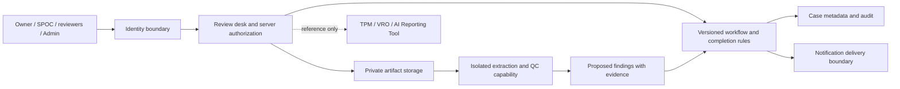

# Planned architecture

Status: boundaries fixed; stack recorded in [ADR-0003](../../adr/0003-stack-and-deployment-boundary.md) (D04, 2026-09-21); paths assigned by the [W0-02 file-level plan](../engineering/implementation-plan-w1-w3.md). No model or production hosting selected (D08-D10 open).

## Boundaries, owners and tickets

Paths were assigned by the [W0-02 file-level plan](../engineering/implementation-plan-w1-w3.md#11-module-ownership) after D04; that plan's module-ownership table is authoritative and this column mirrors it. Paths are relative to the repository root; nothing under them exists until W1-00 creates the skeleton.

| Boundary | Owns | Lane | Spec ticket | Build tickets | Path in repo |
|---|---|---|---|---|---|
| Identity adapter | Verified subject, roles, mode (local-google / network / production) | A | W0-03 | W1-01 | `rai-web/server/src/identity/` |
| Server authorization | Scope on every read, search, download, deep link | A | W0-05 | W1-01, W3-01 | `rai-web/server/src/authz/` |
| Review workflow and Ready predicate | States, transitions, idempotency, audit events | A | W0-06 | W1-05, W2-01 to W2-04, W2-06 | `rai-web/server/src/workflow/`, `rai-web/server/src/versions/` (submit/freeze, version navigation, the workflow transaction with idempotent replay, W1-05) |
| Case metadata, configuration revisions and audit store | Immutable versions, append-only audit, schema evolution | A | W0-04 | W1-00, W1-02, W1-04, W1-05 | `rai-web/server/src/db/`, `rai-web/server/drizzle/` (migrations), `rai-web/server/src/cases/`, `rai-web/server/src/pack/` (nine-slot draft rules, W1-04), `rai-web/server/src/configuration/`, `rai-web/server/src/audit/` |
| Private artifact storage | Protected bytes, hashes, upload safety | A | W0-04, W0-08 | W1-03 | `rai-web/server/src/artifacts/`; bytes in `rai-web/.local/blobs/` (gitignored, `BLOB_DIR`) |
| QC boundary (substitute in slice 1) | Typed findings, unavailable state, no authority | B / C | W0-07 | W1-10, W2-05, W4 | port `rai-web/server/src/qc/`, types `rai-web/shared/src/qc/`, substitute `rai-web/fixtures/src/substitutes/qc/` |
| UI substitute (dev/test only) | Fixture-backed shapes for Lane B; never evidence | C | W0 interface specs | W1-13, W2-10, W3-08 | `rai-web/fixtures/src/substitutes/api/` |
| Notification boundary (mail sink in slice 1) | Committed events, recipients, deep links, dedup | B / C | W0-07 | W1-11, W3-03, W3-04 | `rai-web/server/src/notifications/`, types `rai-web/shared/src/mail/`, sink `rai-web/fixtures/src/substitutes/mail-sink/` |
| Desk observability | Correlation IDs, redacted logs, readiness, operator view | A | W0-10 | W3-07, W8 | `rai-web/server/src/observability/` |
| Product UI | Screens from the design handoff | B | design handoff | W1-06, W1-07, W2-07, W2-09, W3-02 | `rai-web/web/src/` (W1-07: `app.tsx`, `router.tsx`, `routes.ts`, `api/client.ts`, `i18n/`, `session/`, `components/`, `screens/shell/`, `screens/sign-in/`, `screens/cases/`, `styles.css`) |
| External trackers | Reference only (L3, L6) | — | — | none | — |

## Documents this build executes

[PRD](../../PRD.md), [BUILD_PLAN](../../BUILD_PLAN.md), the frozen [source spec](../product/source-spec.md) (hash in [sources](../sources.md)), [workflow](../product/workflow.md), [data contract](../product/data-contract.md), the [design handoff](../design/DEVELOPER_HANDOFF.md) and the [delivery pack](../delivery/README.md).

## Boundaries

Identity adapter normalizes verified subject and roles; server authorization checks scope for every action. Google localhost and production AD are separate configurations. Review workflow owns state, human decisions, idempotency and the final readiness predicate. Model output never authorizes a transition.

Artifact storage owns protected bytes and stable version references. Extraction/QC consumes only authorized evidence and returns typed findings, provenance and unavailable/error states; it has no approval or mail-sending capability. Deterministic checks should handle completeness, version selection and thresholds; model use, if chosen later, addresses evidence interpretation and contradictions.

Notification capability accepts committed business events, authorized recipients, safe deep links and a deduplication key. It returns delivery status, not approval state. External trackers are links only. No live integration, dual-write or SharePoint storage is implied.

Contract errors distinguish unauthenticated/forbidden, stale version, invalid input, unsafe upload, QC unavailable and mail delivery failed. Storage transactions must keep audit, decisions and state consistent; retries cannot create duplicate successor versions or notifications. These are acceptance obligations, not a commitment to microservices: prefer the simplest implementation that preserves boundaries.

[Workflow](../product/workflow.md), [data](../product/data-contract.md), [threat model](../security/threat-model.md) and [ADRs](../../adr/README.md) define details. The stack is recorded (ADR-0003, D04); the shared request/response contract lives in `rai-web/shared/` and is written in the [W0-02 plan](../engineering/implementation-plan-w1-w3.md#7-w1-interface-shapes). Production hosting and operational topology remain gated (D10).
