# Slice 1 work breakdown: W1-W3

Status: **authorized (D03, 2026-09-21); blocked by W0 exit.** All product decisions these tickets depend on (D02, D05, D06, D11, D12) are recorded; the Decisions column names the rule each ticket implements. Packages, entry criteria and exit evidence come from [BUILD_PLAN](../../BUILD_PLAN.md). Acceptance IDs come from [acceptance.md](../acceptance.md). Ticket paths and commands come from the W0 file-level plan, so none are named here. Tickets are outcome-level; the W0-02 PR size rule in [team and roles](team-and-roles.md) may split a ticket into lettered sub-tickets without changing its acceptance IDs.

Slice 1 is done when one synthetic case goes through create → attach → submit → three lanes → one send-back → v2 → three approvals → dispositions → Ready. Access has to be scoped, and history has to survive a restart. This is the first full synthetic workflow milestone, **not PoC acceptance**.

## Owner types

- **Agent-eligible.** An agent may implement it from a [task brief](agent-task-brief-template.md). A human reviews the PR.
- **Human review required (HRR).** Anyone may implement it, but the tech lead reviews authorization, transactions, immutability or readiness logic before merge.
- **Human.** Needs judgement or a stakeholder.

A ticket's `Done when` is the evidence its PR must show; the package exit paragraph is the gate for closing the package, not the ticket.

## Lanes

| Lane | Owns | Typical owner |
|---|---|---|
| A | Server: identity, authorization, cases, versions, lanes, completion predicate, SLA calculation, queue query | Engineer A |
| B | Product UI, notifications, findings/disposition contract | Engineer B |
| C | Platform and substitutes: fixtures, QC and mail substitutes, UI substitute, CI and test harness | Third engineer or agents under briefs |
| Lead | Contract reviews, package exits, integration journeys | Tech lead |

## Dependency map

```mermaid
flowchart LR
    W0[W0 contract] --> W100[W1-00 substrate]
    W100 --> W101[W1-01 identity]
    W100 --> W110[W1-10 QC substitute]
    W100 --> W111[W1-11 mail sink]
    W100 --> W112[W1-12 CI/harness]
    W100 --> W109[W1-09 fixtures]
    W100 --> W113[W1-13 UI substitute]
    W109 --> W113
    W101 --> W102[W1-02 case]
    W101 --> W103[W1-03 artifacts]
    W109 --> W103
    W102 --> W104[W1-04 pack draft]
    W103 --> W104
    W104 --> W105[W1-05 submit/freeze]
    W104 -. contract .-> W106[W1-06 UI pack editor]
    W113 --> W106
    W101 -. contract .-> W107[W1-07 UI shell/cases]
    W102 -. contract .-> W107
    W113 --> W107
    W105 --> W1INT[W1-INT wiring + suite]
    W106 --> W1INT
    W107 --> W1INT
    W112 --> W1INT
    W1INT --> W108[W1-08 W1 exit]
    W108 --> W201[W2-01 lanes open]
    W201 --> W202[W2-02 decide]
    W202 --> W203[W2-03 send-back]
    W203 --> W204[W2-04 resubmit]
    W202 -. contract .-> W205[W2-05 findings/dispositions]
    W110 --> W205
    W204 --> W206[W2-06 Ready predicate]
    W205 --> W206
    W202 -. contract .-> W210[W2-10 substitute ext]
    W205 -. contract .-> W210
    W113 --> W210
    W210 --> W207[W2-07 UI reviewer/history]
    W210 --> W209[W2-09 UI findings/dispositions]
    W207 --> W209
    W206 --> W2INT[W2-INT wiring + suite]
    W207 --> W2INT
    W209 --> W2INT
    W2INT --> W208[W2-08 W2 exit]
    W208 --> W305[W3-05 SLA]
    W208 --> W301[W3-01 queue query]
    W208 --> W303[W3-03 notifications]
    W111 --> W303
    W305 -. contract .-> W303
    W301 -. contract .-> W308[W3-08 substitute ext]
    W305 -. contract .-> W308
    W210 --> W308
    W308 --> W302[W3-02 queue UI]
    W303 --> W304[W3-04 retry/dedup]
    W303 -. contract .-> W307[W3-07 observability baseline]
    W302 --> W3INT[W3-INT wiring + suite]
    W304 --> W3INT
    W305 --> W3INT
    W307 --> W3INT
    W3INT --> W306[W3-06 slice-1 journey]
```

A dotted "contract" edge means the ticket starts once that server ticket's request/response shape has merged, not once the server ticket is finished.

## Merge order and shared contract

Per package: **contract PR → lane PRs in parallel → Wx-INT → exit evidence.**

- **Shared contract.** The W0 interface specs (W0-03 to W0-06) plus the request/response shapes in the W0-02 "W1 interface shapes" section. W1 shapes are written there by W0-02; W2 and W3 shapes are added to that section by the server ticket's contract PR before that server ticket starts. Any change to it is its own PR, merged before every consumer PR.
- **W1-00 is the only ticket that creates shared modules.** W1-01 is the first W1 feature ticket to merge. Its authorization middleware and the W0-03 fixture identity provider are the only place scope is enforced; every later ticket (W1-02 to W1-05, W2, W3) calls it rather than adding its own checks. A change to the middleware is its own PR under W1-01's owner, not part of another ticket.
- **Lanes.** Engineer A's server tickets, Engineer B's UI tickets and Lane C tickets run in parallel once the contract they share is merged. Lane C tickets have no decision gate and merge during W1. Engineer B's UI tickets build against the contract on the substitute (W1-13, extended by the Lane C contract tickets W2-10 and W3-08) and merge independently of the server ticket, each rebased on main before the PR opens. In W1, Lane B's earliest start is after W1-00, W1-09 and W1-13 have merged; those three are deliberately small and are the first W1 PRs. With no third engineer, Engineer B takes W1-09 and W1-13. Substitute runs are never acceptance evidence: a Lane B ticket's Proves IDs are realised only when Wx-INT runs it against the real server.
- **W2.** The server chain W2-01 → W2-02 → W2-03 → W2-04 → W2-06 is sequential by nature. Engineer B is kept busy by starting W2-07 as soon as the W2-02 contract merges and by taking W2-05 in parallel with W2-03/W2-04.
- **Notifications and the queue** consume committed audit events and due-date values through the W0-06/W0-07 contract; they do not modify transition code.
- **W3** starts with W3-05 (small, Lane A); W3-02 and W3-03 need only its due-date and breach-query shapes, so Lane B starts as soon as that contract PR merges.
- **Wx-INT** (W1-INT, W2-INT, W3-INT) is the one ticket per package exempt from the one-module rule: it is a declared multi-lane integration ticket. It wires the UI to the real server, removes the substitute from that package's app path, and authors the automated journey and the negative tests in that package's exit evidence. The exit ticket (W1-08, W2-08, W3-06) stays Lead/Human and is narrowed to running the Wx-INT suite and recording command, output and fixture identity in `changes/<date>-<slug>/review.md`.

---

## W1 — scoped case and versioned pack

Entry: W0 exit and an approved upload policy (W0-08). Requirements: R1, R2, R7. **Milestone M1:** one synthetic case is created, attached, submitted, restarted and reopened by its owner, and refused to everyone out of scope.

| ID | Outcome | Proves | Depends on | Decisions | Lane | Owner type | Done when |
|---|---|---|---|---|---|---|---|
| W1-00 | Shared W1 substrate in one PR: repo skeleton and commands exactly as the W0-02 plan states; persistence base for Case, pack version, artifact slot, configuration revision and audit event (W0-04), with the configuration revision store seeded from a minimal seed inside this ticket (`checklist_template_version` list, SLA values and calendar, and `operator_recipients` holding the single synthetic operator recipient address from W0-08 (D06); lane mapping is not part of it and stays the W0-06 versioned constant recorded on each version) and the provisional activation rule "a revision applies to submissions after its publish time" until W6; the seven W0-06 error types with the codes chosen in W0-01; authorization policy module holding the W0-05 view / create-edit-submit / download rows as data (the D05 disposition and self-approval rows arrive with W2-02's contract PR); fixture identity provider with the six synthetic users and the W0-03 dual-role identity (W0-03 test substitute; W1-00 owns the users, W1-09 owns cases and documents). No endpoints, no UI. Later tickets extend these modules; none recreates them. Request/response shapes come from the W0-02 W1 interface shapes section, not from here. | Feeds A01, A02, A07 | W0 exit (W0-02 to W0-06) | — | A | HRR | Installs and tests from a clean checkout with the W0-02 commands; each error type has a test; the policy module rejects an unknown role; nothing grants access without a policy row; a published configuration revision cannot be updated or deleted and is read back by ID unchanged after a later revision is published; the audit store has no update or delete path in the data-access layer. |
| W1-01 | Local sign-in through the identity adapter in `local-google` mode (loopback only, per W0-03), plus the test-only fixture identity provider with six synthetic role users and one dual-role identity (from W1-00); server-side authorization middleware, the only place scope is enforced | A01 (local) | W1-00, W0-03, W0-05 | — | A | HRR | Each fixture user, including the dual-role identity, signs in through the fixture identity provider and receives its (role, scope) pairs (the `local-google` positive path is proved at W1-08, not here); a request without a session is unauthenticated; a wrong-role request is forbidden; `local-google` refuses to start on a non-loopback bind and on an unknown mode. |
| W1-02 | Create and edit case: inherited fields, `source_record_id` or `Unknown`, owner/BU scope; read one case and list the actor's own or BU-scoped cases (the query W1-07 consumes; search, filters and counts arrive in W3-01); `use_case_group` stored as required with its value list read from configuration (D11); `vendor_involved` and `model_type` stored as desk-local fields (data contract Case row, confirmed under W0-04) | A02, A01 | W1-00, W0-04, W1-01 | D11 | A | Agent-eligible | A case with `Unknown` source saves; a known `TPM-…`/`VRO-…` value is stored and read back unchanged; the external register is never called; a user from another BU is forbidden on read, list and write; `use_case_group` rejects a value outside the configured list; the four inherited status fields follow the W0-04-confirmed rule, and a write to any of them that the rule forbids is rejected. |
| W1-03 | Artifact upload and download: type and size checks, content hash, private storage, authorized download only; Thai filenames handled | A01 (direct-file negative), A07 | W1-00, W0-04, W0-08, W1-01, W1-09 | D08 limits for real data only | A | HRR | A permitted file uploads and its hash is recorded; an executable disguised by extension is rejected with the unsafe-upload error; a direct file URL without an authorized session is refused; downloaded bytes match the stored hash; a Thai filename round-trips unchanged. |
| W1-04 | Nine-slot draft pack: attached, not yet, missing, N/A with reason; reasons required; DPA/SOW default N/A when `vendor_involved` is false; `checklist_template_version` recorded; `stage_context` (idea / pre-build / pre-launch, D11) stored on the draft and frozen with the version in W1-05; nothing in slice 1 reads it beyond storage | A02 | W1-02, W1-03 | D11 | A | Agent-eligible | All four slot states save; a missing reason on N/A is rejected; slots 3 and 4 default to N/A only when `vendor_involved` is false; `checklist_template_version` is recorded on the draft. |
| W1-05 | Submit freezes an immutable version with artifact refs, template and configuration revisions (QC, risk and SLA), and the stage context (D11). Later drafts are separate. Data survives restart. Writes the submit audit event. | A07 | W1-04, W0-06 | D11 | A | HRR | Submit writes an immutable version that records the exact configuration revision ID and the lane-mapping constant version; a second write to that version's artifact ref is rejected; the case and version reopen unchanged after process restart; the submit audit event carries actor, version and correlation ID. |
| W1-06 | UI: case overview, nine-slot pack editor and version navigation as one flow, built against the W1-04 contract on the W1-13 substitute | A02 | W1-04 (contract), W1-12, W1-13 | D12 | B | Agent-eligible | Every slot state and reason is reachable; the N/A reason field cannot be skipped; no client-side check decides access; keyboard-only operation of every action; the automated accessibility audit (W0-02) passes with zero critical issues; no hard-coded user-facing string. |
| W1-07 | UI: app shell, sign-in, new-case form, the user's own case list (full queue arrives in W3), against the W1-01/W1-02 contracts on W1-13 | A01, A02 | W1-01, W1-02 (contracts), W1-12, W1-13 | D12 | B | Agent-eligible | Sign-in for each fixture user lands on that user's scoped list; an out-of-scope case is absent from the list; no client-side check decides access; keyboard-only operation; accessibility audit zero critical; no hard-coded user-facing string. |
| W1-09 | Synthetic case and document fixture set per W0-08 (non-vendor, vendor, missing slot, N/A reasons) including one Thai-named file; references the fixture users and the `operator_recipients` seed owned by W1-00, including one case in the BU whose SPOC is the dual-role identity | Enables A01/A02/A07 evidence | W0-08, W0-03, W1-00 | — | C | Agent-eligible | Fixtures load into a clean database with one command; a reviewer confirms no text matches any real case or Life-OS content; each fixture states the identity that evidence records cite. |
| W1-10 | QC test substitute per W0-07: scripted synthetic typed findings, explicit `unavailable`, simulated timeout, no write access to workflow state. **Substitute only; do not label QC as implemented (W4).** | Feeds A09 (W2-05) | W0-07, W1-00 | — | C | Agent-eligible | Returns scripted findings for a version ref; returns `unavailable` on demand; simulates a timeout; a test asserts it has no write path to workflow state. |
| W1-11 | Mail-sink substitute per W0-07: file or in-memory sink, accepts committed event + recipients + deep link + dedup key, returns delivery status, can be told to fail, no external mail | Feeds A05 (W3-03, W3-04) | W0-07, W1-00 | — | C | Agent-eligible | Accepts the four inputs and returns a status; a forced failure is reported; no external mail path exists in any configuration. |
| W1-12 | CI checks and local test harness per W0-02 (tests, lint, link check, frozen-source hash, accessibility audit in the browser suite; browser-test runner from W0-01 criterion 7). The demo suite stays separate from the product suite. | Feeds every exit | W0-02, W1-00 | — | C | HRR (agents may not change CI) | Every PR runs all checks and blocks merge on failure; a deliberately altered source snapshot fails the hash check; browser tests run locally without external services. |
| W1-13 | Dev/test-only in-memory substitute serving the W1 request/response shapes (sign-in, case, artifacts, pack draft, version navigation) from the W0-02 W1 interface shapes section, backed by W1-09 fixtures, returning W0-06 error types. Never checks or encodes permissions on the client, never deployed, never acceptance evidence. | Feeds W1-06, W1-07 | W1-00, W1-09 | — | C | Agent-eligible | Each shape in the W0-02 W1 interface shapes section has a substitute response; a request the spec marks forbidden returns the forbidden error type; the substitute is absent from non-test configuration. |
| W1-INT | Wire W1-06/W1-07 to the real server; remove W1-13 from the app path; author the automated W1 journey (create → attach → submit → restart → reopen), one positive test in which the BU SPOC of the owner's BU submits a second fixture case owned by that owner (the submit audit event records the SPOC as actor and the case owner is unchanged), and the negative tests in the W1 exit evidence | A01, A02, A07 | W1-05, W1-06, W1-07, W1-12 | — | A+B | Agent-eligible (lead reviews) | Journey and negatives pass against the real server from a clean checkout; no test imports the substitute; the evidence configuration cannot load the substitute. |
| W1-08 | W1 exit: run the W1-INT suite, including negative tests (wrong role, other BU, direct file URL, unsafe upload, `local-google` refuses a non-loopback bind and an unknown mode and fails closed per W0-03); one manual sign-in with a Google account through `local-google` on a loopback bind, outside CI, with the OAuth client held locally and never committed, recorded as "Google sign-in on loopback: pass" without the account address; record command, output and fixture identity in `changes/<date>-<slug>/review.md` | A01, A02, A07 | W1-INT | — | Lead | Human | The record names commands, output, fixture identity and every A-ID; nothing is marked recorded without output. |

**W1 exit evidence (from BUILD_PLAN):** A01 local-role access and direct-file negative tests; A02 all slot dispositions and non-vendor defaults; A07 submitted bytes cannot be overwritten; the same case reopens after restart; unsafe uploads and unauthorized requests fail safely; `local-google` refuses a non-loopback bind and an unknown mode (fail-closed per W0-03); one manual Google sign-in through `local-google` on a loopback bind passes (human, outside CI; OAuth client local, never committed; no account address recorded). Record the command, output and fixture identity.

---

## W2 — parallel reviews, send-back and completion

Entry: W1 exit. D02 and D05 are recorded. Requirements: R4, R7, R9. **Milestone M2:** v1 → send-back → v2 → three approvals → dispositions → Ready, on the real server, reconstructable from the audit trail alone.

| ID | Outcome | Proves | Depends on | Decisions | Lane | Owner type | Done when |
|---|---|---|---|---|---|---|---|
| W2-01 | Submit opens all three lanes atomically, using the D02 slot mapping (AI/COE 1+5, DPO 2-5, IT/Security 5-8) held as a versioned constant and recorded on the version; High risk never skips a lane | A04 | W1-08 | D02 | A | HRR | Submit opens exactly three lanes in one transaction with the D02 slot mapping; a failure in any lane opening rolls back all; a High-risk case cannot skip a lane. |
| W2-02 | Lane decision: approve or send back. The reviewer acts only on their own lane, with an expected-version check and idempotency key. Send-back requires feedback that names an artifact. Admin has no lane authority. Adds the D05 rows (owning-lane disposition authority, owner proposes "fixed", no self-approval) to the W1-00 policy module as its contract PR; W2-05 consumes them. Writes the decision audit event. | A01, A09 | W2-01, W0-05 | D05 | A | HRR | A reviewer decides only their lane; a stale expected version is rejected; a repeated idempotency key changes nothing; send-back without a named artifact is rejected; Admin's decision attempt is forbidden; a lane reviewer who is owner or BU SPOC on the case is forbidden from approving or sending back that lane (D05); the audit event carries actor, version, lane and correlation ID. |
| W2-03 | Send-back keeps version N readable and creates one editable N+1 draft. Concurrent send-backs share that draft. Stale actions are rejected with refresh guidance. Writes the audit event. | A07 | W2-02 | D05 | A | HRR | Version N stays readable after send-back; one N+1 draft exists after two concurrent send-backs; a stale action returns refresh guidance and changes nothing. |
| W2-04 | Resubmit N+1 under D05: all lanes re-review; N approvals never reused. Writes the audit event. | A07 | W2-03 | D05 | A | HRR | Resubmit creates N+1 with all three lanes pending; no N approval is carried; the audit trail shows both versions. |
| W2-05 | Findings and disposition contract fed by **synthetic** findings through the W1-10 QC substitute. Fixed; waived with reason; N/A with reason; attributable, append-only. Authority per D05: owning lane records waived and N/A, owner proposes "fixed" for the owning lane to confirm. Writes the disposition audit event. | A09 | W2-02 (contract), W1-10, W0-07 | D05 | B | HRR | A waived or N/A disposition without a reason is rejected; a waiver by a non-owning lane is forbidden, tested on a single-lane finding, a slot-5 (BRD) finding and a pack-level finding, each carrying the owning lane the W0-06 rule assigns; an owner's "fixed" stays proposed until the owning lane confirms; a disposition never modifies the finding; a second disposition appends; an `unavailable` QC result is recorded, not treated as zero findings. |
| W2-06 | Ready predicate: three current-version approvals and zero undispositioned findings. Atomic final recheck. The label means desk completion, not Council or ITSM approval. Writes the audit event. | A09 | W2-04, W2-05 | D05 | A | HRR | Ready is set only with three current-version approvals and zero undispositioned findings; a stale approval or an open finding blocks it; the final recheck runs inside the transition. |
| W2-10 | Lane C: extend the W1-13 substitute with the W2 shapes (lane decision, send-back feedback, findings/disposition, history) as a contract PR, so Lane B never edits the substitute inside a UI ticket | Feeds W2-07, W2-09 | W2-02 (contract), W2-05 (contract), W1-13 | — | C | Agent-eligible | Each W2 shape has a substitute response and its forbidden and stale-version error cases; still absent from non-test configuration. |
| W2-07 | UI: reviewer workspace (findings shown before actions, rendered from W1-10 typed-finding fixtures), send-back feedback form, version history with frozen snapshots | A09, A07 | W2-02 (contract), W1-05, W2-10 | D05; D12 | B | Agent-eligible | Findings render before the decision controls; the feedback form cannot submit without naming an artifact; history shows each frozen version unchanged; keyboard-only operation; accessibility audit zero critical; no hard-coded user-facing string. |
| W2-09 | UI: findings and disposition UI | A09 | W2-05 (contract), W2-07, W2-10 | D05; D12 | B | Agent-eligible | Each disposition kind is reachable; reason is mandatory for waived and N/A; a finding never disappears after disposition; keyboard-only operation; accessibility audit zero critical. |
| W2-INT | Wire W2-07/W2-09 to the real server; remove the W2-10 substitute extension from the app path; author the automated W2 journey and the negatives in the W2 exit evidence | A04, A07, A09 | W2-06, W2-07, W2-09 | — | A+B | Agent-eligible (lead reviews) | Journey and negatives pass against the real server; no test imports the substitute; the evidence configuration cannot load the substitute. |
| W2-08 | W2 exit: run the W2-INT suite (v1 → send-back → v2 → three approvals; concurrent send-back, stale approval, undispositioned finding, Admin-approval and self-approval negatives); record evidence | A04, A07, A09 | W2-INT | — | Lead | Human | Record as W1-08; in addition, for A11, the full journey is reconstructable from audit events alone and an attempted update or delete of an audit row through the application fails. |

**W2 exit evidence (from BUILD_PLAN):** A04, A07 and A09. Submit v1, review all lanes with one send-back, edit v2 and complete three reviews. Concurrent send-backs do not fork successors, stale approvals fail, undispositioned synthetic findings block final readiness, Admin cannot approve without lane authority, and a reviewer who is owner or BU SPOC on the case cannot approve its lane (D05). **Do not label QC as implemented.** Real QC is W4.

---

## W3 — queue, notification links and SLA reporting

Entry: W2 exit. D06 and D11 are recorded. Requirements: R5, R6. Completes source slice 1. **Milestone M3 (slice 1):** the whole journey runs from queue discovery through notification links on the real server, with mail failure, working-day boundaries and desk health visible to the operator audience.

| ID | Outcome | Proves | Depends on | Decisions | Lane | Owner type | Done when |
|---|---|---|---|---|---|---|---|
| W3-01 | Role-scoped queue query: search by `source_record_id`, status, owner, group or all. Counts, pagination and filter options never reveal out-of-scope cases. Thai text searches correctly. | A06 | W2-08 | D11 | A | HRR | Each search key returns only in-scope cases; counts and filter options for an out-of-scope user match a user with no such cases; pagination never leaks a case; a Thai search term matches. |
| W3-02 | Queue UI: case cards with latest version, lane states, due dates and next action, against the W3-01 contract on the substitute | A06 | W3-01 (contract), W3-05 (contract: due-date shape), W3-08 | D12 | B | Agent-eligible | Cards show all four items; an out-of-scope case is absent; a deep link into a card requires sign-in; keyboard-only operation; accessibility audit zero critical; no hard-coded user-facing string. |
| W3-03 | Notifications emitted only after a committed event: lane open, send-back, Ready, SLA breach. Uses the W1-11 mail sink. Deep link that still requires sign-in and scope. Contents follow the source spec notification table (lane-open mail carries the W3-05 due date). The SLA-breach report, one daily digest to the `operator_recipients` configuration (D06), is sent from here using the W3-05 breach query. Templates use locale keys and Thai-safe subjects. | A05 | W2-08, W0-07, W1-11, W3-05 (contract: due-date and breach-query shapes) | D06; D12 | B | HRR | No mail exists for a rolled-back transition; each of the four events produces one mail with the specified contents; the deep link without a session is unauthenticated; a breach mail lists only cases past SLA; a Thai subject line is intact. |
| W3-04 | Delivery failure recorded and visible to Admin (D06); three retries with backoff; deduplication by (event, version, lane, recipient). A failure never undoes a committed decision. | A05 | W3-03 | D06 | B | Agent-eligible | A forced sink failure is recorded and retried three times with backoff (D06); a duplicate dedup key sends nothing; the committed decision is unchanged after a permanent failure. |
| W3-05 | Working-day SLA calculation (Asia/Bangkok, Thai public-holiday list from configuration, clock starts when the lane opens and restarts on each new submitted version, per D06); per-lane due date exposed for the queue and lane-open mail; breach query the notifier consumes; no automatic escalation. SLA values (DPO 3 per D01, other lanes 5 working days) are read from the configuration revision frozen on the version at submit (W1-00, W1-05, L12), never hardcoded; Admin editing of them arrives in W6. | A05 | W2-08 | D06 | A | Agent-eligible | A lane opened before a weekend or holiday gets the correct due date; the clock restarts on resubmit; a changed configuration revision does not alter an already-frozen version's due date; the breach query returns only cases past due. |
| W3-08 | Lane C: extend the substitute with the W3 queue and due-date shapes as a contract PR | Feeds W3-02 | W3-01 (contract), W3-05 (contract), W2-10 | — | C | Agent-eligible | Queue and due-date shapes have substitute responses with scope-forbidden cases; still absent from non-test configuration. |
| W3-07 | Local observability baseline per W0-10: structured log with correlation ID shared with the audit event, notification record and QC run; liveness/readiness check reporting identity mode, store reachability and mail-sink status; minimal operator view of failed mail and unavailable QC runs. Desk health only, not AI-use-case monitoring. | Feeds W7/W8 operability | W0-10, W3-03 (contract: delivery-status shape) | — | A | Agent-eligible | A forced mail failure and a simulated QC timeout each appear once in the operator view and in the log with the same correlation ID; the readiness check fails closed when the identity mode is misconfigured; no document content or personal data appears in any log line. |
| W3-INT | Wire W3-02 to the real server; remove the substitute from the app path (last package that uses it); author the automated slice-1 journey and the W3 negatives (mail failure/retry, working-day boundaries) | A05, A06 | W3-02, W3-04, W3-05, W3-07 | — | A+B | Agent-eligible (lead reviews) | Journey and negatives pass against the real server in CI; the substitute is no longer in the repository's app configuration; the evidence configuration cannot load it. |
| W3-06 | Slice-1 journey: run the W3-INT suite as the full W1-W2 journey plus queue discovery and notification links, as one automated UI journey against the real server, never the substitute, with a recorded walkthrough as supplementary evidence and one keyboard-only pass; mail failure/retry (W3-04) and working-day boundary (W3-05) test outputs recorded as evidence | A01, A02, A04 to A07, A09 | W3-INT | — | Lead | Human | Automated journey passes in CI; walkthrough, keyboard-only pass and test outputs recorded as W1-08. |

**W3 exit evidence (from BUILD_PLAN):** A05 and A06, mail failure and retry tests, working-day boundary cases, and the single end-to-end UI journey with a recorded walkthrough and test outputs.

---

## W3 follow-ups (after M3, 2026-09-26)

W3 was accepted on 2026-09-26. These tickets implement Ta's rulings of the same day (register row "W3 deferred rulings"); they run under D03 as W3 work on synthetic data. The GitHub issue is the tracker; this table is the document of record.

| ID | Outcome | Proves | Depends on | Decisions | Lane | Owner type | Done when |
|---|---|---|---|---|---|---|---|
| W3-F1 (#163) | Names, not subject IDs, in case, version and decision reads | A01 (scope kept) | — | Rulings item 8 | A+B | HRR | A W0-02 section 7 read-shape contract PR adds display names (subject IDs stay for audit; no new user-lookup endpoint; names never logged; no cross-BU leak per W0-05), then a UI PR renders them in both locales at three widths. |
| W3-F2 (#164) | A lane reviewer who is BU SPOC on the case gets no lane-opened mail for that lane; the page says why the panel is absent | A05 | — (see the 2026-09-26 note below) | Rulings item 10 | B | HRR | W0-05 3.3 table and T28 updated; recipient composition excludes BU-SPOC reviewers per case and lane, tested with `fx-user-dpo-spoc-hr` on the HR case; bilingual page note. |
| W3-F3 (#165) | The lane-opened mail counts that lane's findings stored at send time, labelled "so far" | A05 | — | Rulings item 11 | B | Agent-eligible | W0-06 4.11 and W0-07 section 4 `defectCount` wording updated (renamed `findingCount` by W3-F3, since it counts both kinds); the ticket states whether QC-unavailable and already-dispositioned findings count; a test with findings on two lanes shows per-lane counts. |
| W3-F4 (#166) | The owner's send-back mail opens the successor draft | A05 | — | Rulings item 12 | B | Agent-eligible | W0-07 section 4 `SafeDeepLink` for `sent_back` names the draft; protected-link tests updated. |
| W3-F5 (#167) | One Thai term, "การตรวจทานในระบบเสร็จสิ้น", for desk completion everywhere, including the status badge | A11 (D12 language) | — | Rulings, status name | B | Agent-eligible | Every Thai string for the state (queue, case page, badge, mail subject and body, next action, decided-Ready and stale-version messages) uses the term; a test asserts it; axe passes in th and en. English is unchanged. |
| W3-F6 (#168) | The unused `scopedCases` helper is gone | — | — | Rulings item 5 | A | Agent-eligible | Code and the W0-04 and performance-targets references removed; full suite green; no behaviour change. |
| W3-F7 (#169) | `BLOB_TMP_MAX_AGE_HOURS` below 1 is refused | A07 | — | Rulings item 7 | A | Agent-eligible | W0-02 section 5 says "Integer ≥ 1"; start-up and `store:cleanup` refuse lower values with a test; a temporary upload younger than one hour is not swept. |

W3-F2 note (2026-09-26, PR #174): the "why" note is derived in the SPA from the session's own grants and `CaseView.businessUnitId`, not from a new W0-02 read field. W0-05 section 6 allows a display-only client derivation; the API still answers 403, and the note reveals nothing the user cannot already read. The read-shape step this row first listed was therefore not needed; the lead or Ta confirms this on the PR.

W3-F4 note (2026-09-26): the SPA has no draft-specific URL; the case page (`/cases/{caseId}`) shows the open successor draft and its send-back feedback. So the send-back link is the case page (route `case`), stored on the committed outbox row and checked against the composed mail, rather than a link that names the draft id. It opens the successor draft, as ruling 12 asks.

## Traceability check

Rows list every ticket whose Proves column names the ID, including Wx-INT and exit tickets. Tickets whose Proves column says "Feeds" or "Enables" (W1-00, W1-09 to W1-13, W2-10, W3-07, W3-08) are enabling work and are omitted.

| Requirement | Acceptance | Tickets |
|---|---|---|
| R1 (local part) | A01 | W1-01, W1-02, W1-03, W1-07, W1-INT, W1-08, W2-02, W3-06 |
| R2 | A02 | W1-02, W1-04, W1-06, W1-07, W1-INT, W1-08, W3-06 |
| R4 | A04 | W2-01, W2-INT, W2-08, W3-06 |
| R5 | A05 | W3-03, W3-04, W3-05, W3-INT, W3-06 |
| R6 | A06 | W3-01, W3-02, W3-INT, W3-06 |
| R7 | A07 | W1-03, W1-05, W1-INT, W1-08, W2-03, W2-04, W2-07, W2-INT, W2-08, W3-06 |
| R9 | A09 | W2-02, W2-05, W2-06, W2-07, W2-09, W2-INT, W2-08, W3-06 |
| Attributable actions (PRD quality property) | A11 | W1-05, W2-02 to W2-06, W2-08 |

Not in slice 1 and not yet authorized: R3 risk (W5), R8 real QC (W4), R10 Admin configuration (W6), production AD for R1 (W8), network identity mode for R1 (W7, only if the rehearsal is networked). See [later packages](later-packages-outline.md).
