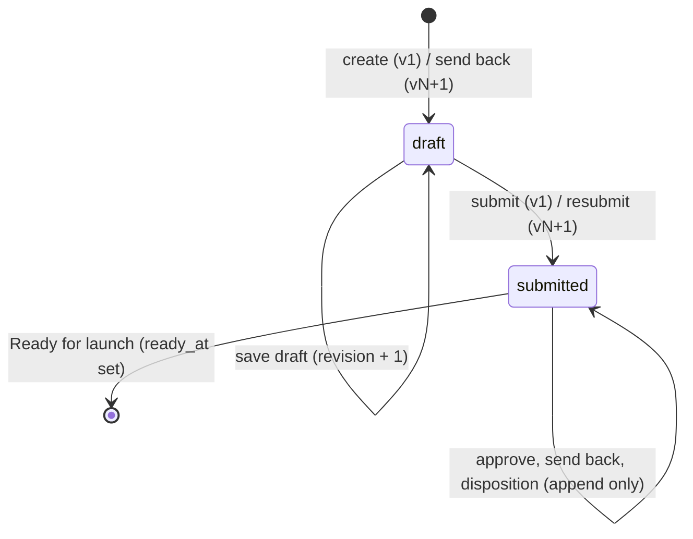

# Workflow transition and error contract (W0-06)

Status: **W0 interface spec, written 2026-09-21 under ticket W0-06 (issue #11). Human review required (tech lead).** Nothing here is implemented; the consuming tickets are named per section. Source rules come from the frozen [source spec](../product/source-spec.md) and the [workflow contract](../product/workflow.md); recorded decisions D02, D05, D06, D11, D12 and the W0-04 field rule from the [register](../product/decisions.md) are carried as written. D07-D10 stay open and nothing below resolves them. HTTP codes come from [ADR-0003](../../adr/0003-stack-and-deployment-boundary.md) "Contract error codes"; this document confirms them and adds the body shapes.

Stack (D04): TypeScript on Node 24, Fastify, Drizzle on Postgres 16, `node:test` and Playwright. The rules are stated so that they would hold under any stack; the stack-specific paragraphs say how to realise each rule with the chosen one. Repository paths follow the W0-02 file-level plan (`docs/engineering/implementation-plan-w1-w3.md`, written in parallel on its own branch; linked from here once it merges); where this document names a path it uses the `rai-web/*` layout that ADR-0003 proposed for W0-02, and W0-02 is authoritative if the two differ.

Proves (when built): **A04** (one submission opens three lanes with the D02 mapping), **A07** (immutable versions, one successor on concurrent send-backs, stale actions fail, idempotent replay, every resubmission reopens all lanes), **A09** (Ready only from current-version approvals plus dispositions; no self-approval). Feeds A11 (audit trail reconstructs the journey).

## 1. Scope and consumers

This contract defines, for the review desk's workflow:

1. the stored state (section 2) and the derived case status (section 2.4);
2. the lane-mapping constant (section 3);
3. every workflow event: actor, preconditions, checks in order, postconditions, audit event, side effects and error cases (section 4);
4. the expected-version and idempotency rules (section 5);
5. the Ready predicate (section 6);
6. the owning-lane assignment rule for findings, with the D05 refinement the review leads must record before W2-05 (section 7);
7. the error contract: the seven types plus `not_found`, their HTTP codes, response envelope, locale keys and refresh guidance (section 8);
8. the transaction and audit mechanics on Postgres (section 9);
9. the tests each consuming ticket owes (section 10).

| Consumer | Uses |
|---|---|
| W0-02 file-level plan | Error envelope and `ExpectedVersion` shape in the "W1 interface shapes" section; error cases per endpoint |
| W0-03 identity adapter | `unauthenticated` semantics; fixture identities used in the self-approval tests |
| W0-04 persistence spec | Entity fields this contract needs (section 2.5); transaction and audit rules (section 9) |
| W0-05 authorization matrix | Actor column of every event; the `forbidden` decision; 403-vs-404 open item |
| W0-07 QC boundary and mail sink | `owning_lane` assignment (section 7); `qc_unavailable` and `mail_delivery_failed` (section 8) |
| W0-10 observability | Correlation ID on every error and audit event; error capture by the codes in section 8 |
| W1-00 | Error types and codes as a shared module; lane-mapping constant; audit store with no update/delete path |
| W1-02, W1-04 | Create and save-draft events; draft revision check |
| W1-05 | Submit event: freeze, `lane_mapping_version` recorded, audit event |
| W1-13, W2-10, W3-08 | Substitutes return the same error envelope and codes |
| W2-01 | Lane opening from the constant, atomic with submit |
| W2-02 | Approve and send-back events, expected-version and idempotency checks, D05 no-self-approval, Admin has no lane authority |
| W2-03, W2-04 | Successor draft merge rule; resubmit reopens all lanes |
| W2-05 | Disposition events and authority; owning-lane rule (blocked on the section 7 refinement for shared and pack-level findings) |
| W2-06 | Ready predicate and atomic recheck |
| W3-01 | Derived case status vocabulary for search |
| W3-03, W3-04 | Notification triggers (committed events only) and the `mail_delivery_failed` record |

## 2. State model

### 2.1 Entities and identity

Names follow the [data contract](../product/data-contract.md). Field-level persistence (types, indexes, migrations) is W0-04's; this section lists what the workflow reads and writes.

- **Case.** Stable desk-local ID; owner and BU scope (`business_owner`, `business_unit`); `current_version_id` (the latest version by number, draft or submitted); `latest_submitted_version_id` (null until the first submit); `ready_version_id` (null until Ready). The four inherited status fields are read-only projections (W0-04 fields rule, section 4.10).
- **Pack version.** `case_id`, `version_number` (1, 2, 3 ...; unique per case), `state` ∈ {`draft`, `submitted`}, `revision` (integer; see section 5.1), `parent_version_id` (null for v1), `submitted_by`, `submitted_at`, `checklist_template_version`, `config_revision_id` (QC, risk and SLA revision frozen at submit; W1-00, L12), `stage_context` (D11), `lane_mapping_version` (section 3), `ready_at` (null unless this version reached Ready). Exactly one draft may exist per case at a time (partial unique index; section 9.3).
- **Artifact slot.** Nine per version: `slot` 1-9, `disposition` ∈ {`attached`, `not_yet`, `not_applicable`, `missing`}, `reason` (required for `not_applicable`), immutable blob reference and hash when attached (W1-03, W0-08).
- **Lane.** A value, not a table row: `ai_coe`, `dpo`, `it_security`. A lane's state on a submitted version is derived from its lane decision (section 2.3).
- **Lane decision.** `version_id`, `lane`, `decision` ∈ {`approved`, `sent_back`}, `actor_id`, `actor_role`, `decided_at`, `feedback` (required for `sent_back`; names at least one artifact slot and the deficiency), `qc_run_id` (approve: the lane-QC run the reviewer saw before deciding, which may be an `unavailable` run; send back: optional). Unique on (`version_id`, `lane`): one decision per lane per version, never updated.
- **QC run and finding.** Written by the QC boundary (W0-07) through the workflow, never by QC directly. Each finding carries `version_id`, `rule_id`, `rule_revision`, `trigger` ∈ {`upload`, `submit`, `approve_attempt`}, `slot` (1-9 or null for pack-level), `kind` ∈ {`defect`, `unavailable`}, `severity`, evidence location and `owning_lane` (section 7). Append-only.
- **Disposition event.** `finding_id`, `kind` ∈ {`fixed_proposed`, `fixed_confirmed`, `fixed`, `waived`, `not_applicable`}, `actor_id`, `actor_role`, `reason` (required for `waived` and `not_applicable`), `evidence`, `recorded_at`. Append-only; a finding's effective disposition is its latest event (section 4.8).
- **Audit event.** `event_type` (section 4 names), `actor_id` (or `system`), `actor_role`, `case_id`, `version_id`, `lane` (nullable), `target_ref` (finding, decision or disposition ID), `correlation_id`, `idempotency_key` (nullable), `occurred_at`, `before_ref` and `after_ref` (references to the state rows, never document bytes). Append-only, same transaction as the change it describes (W0-04 audit rule).
- **Idempotency record.** Section 5.3.
- **Notification outbox row.** Written in the same transaction as the committed event that triggers it; delivered by W3-03 after commit (section 4.11).

### 2.2 Version states



A submitted version never changes state again. "Closed" is not a stored state; it is derived: a submitted version is **closed** when a successor draft exists or `ready_at` is set. A closed version accepts no approval. A version closed by a successor draft still accepts a merging send-back (section 4.5) and dispositions on its findings as history (section 4.7); a Ready version accepts only reads.

### 2.3 Lane states on a submitted version

| Lane state | Derived from |
|---|---|
| `pending` | No lane decision row for (version, lane) |
| `approved` | Decision row with `decision = approved` |
| `sent_back` | Decision row with `decision = sent_back` |

Lane states exist only on submitted versions. All three lanes are `pending` the instant a version is submitted (section 4.3). A lane's state on version N says nothing about version N+1 (D05).

### 2.4 Derived case status

Stored nowhere; computed from the rows above, in this order (first match wins). W3-01 filters by it; W3-02 and W1-07 display it. Values are codes; the display text is a locale key (`status.<code>`), Thai default (D12).

| Code | Rule | Locale key |
|---|---|---|
| `ready_for_launch` | `ready_version_id` is set | `status.ready_for_launch` |
| `sent_back` | Current version is a draft with `parent_version_id` set (a successor draft exists after at least one send-back) | `status.sent_back` |
| `draft` | Current version is a draft with no parent (v1 never submitted) | `status.draft` |
| `awaiting_disposition` | Current version is submitted, all three lanes `approved`, at least one finding on it is undispositioned (section 6) | `status.awaiting_disposition` |
| `in_review` | Otherwise: current version is submitted and at least one lane is `pending` (or, defensively, the Ready recheck did not hold) | `status.in_review` |

There is no other value. "Ready for launch" means desk completion only, never Council or ITSM authorization (L8, PRD). The design demo's label "Changes requested" for the sent-back state is display copy that Lane B may keep under `status.sent_back`; the code is fixed here.

### 2.5 What the workflow asks of W0-04

The persistence spec must provide, at minimum: the fields listed in 2.1; the uniqueness constraints in 9.3; a row lock on Case (`SELECT ... FOR UPDATE`) usable from a Drizzle transaction; append-only lane decision, finding, disposition and audit tables with no update or delete path in the data-access layer; and the idempotency table of 5.3. Retention and deletion design stays W0-04's option list for D08 and is not touched by any event below.

## 3. Lane mapping constant

Recorded decision D02: AI/COE reviews slots 1 and 5; DPO 2, 3, 4, 5; IT/Security 5, 6, 7, 8; slot 9 has no lane gate. All lanes open regardless of proposed risk tier (source spec "Risk tier": High never skips a lane).

The mapping is a **versioned constant in code**, exported from the shared package (`rai-web/shared`, path per W0-02), and is **not** a configuration revision: the source spec's Admin row covers document templates, QC rules and thresholds, SLA values and the production AD group-to-role mapping (R10, L12), not which lane reviews which slot. Admin cannot edit it, no endpoint writes it, and the configuration-revision store (W1-00) never holds it.

```ts
// rai-web/shared/src/workflow/lane-mapping.ts  (path per W0-02)
export type Lane = 'ai_coe' | 'dpo' | 'it_security';
export type Slot = 1 | 2 | 3 | 4 | 5 | 6 | 7 | 8 | 9;

export interface LaneMapping {
  readonly version: string;                       // recorded on every submitted version
  readonly decision: 'D02';                       // register row that fixes it
  readonly slotsByLane: Readonly<Record<Lane, readonly Slot[]>>;
  readonly noLaneGate: readonly Slot[];
}

export const LANE_MAPPING_V1: LaneMapping = Object.freeze({
  version: 'lane-mapping/v1',
  decision: 'D02',
  slotsByLane: {
    ai_coe:      [1, 5],
    dpo:         [2, 3, 4, 5],
    it_security: [5, 6, 7, 8],
  },
  noLaneGate: [9],
});

export const CURRENT_LANE_MAPPING = LANE_MAPPING_V1;
```

Rules:

- **Recorded on the version.** Submit and resubmit copy `CURRENT_LANE_MAPPING.version` into `pack_versions.lane_mapping_version` (W1-05 done-when). Every later read of a version's lanes resolves the mapping by that recorded version string, never by `CURRENT_LANE_MAPPING`, so a future `lane-mapping/v2` cannot reinterpret an old version.
- **Changing it** is a code change that adds a new frozen constant (`LANE_MAPPING_V2`), keeps `LANE_MAPPING_V1` exported for old versions, and needs a new register row (a changed D02) before the constant switches. Agents may not do this (team-and-roles "may not").
- **Frozen by test.** A unit test asserts the exact slot sets and the version string of `LANE_MAPPING_V1` (A04 expected values are frozen on D02); changing the constant fails that test until the test is deliberately updated in the same PR as the register row.
- **Lane lookup helpers** (`lanesForSlot(slot, mapping): Lane[]`, `slotsForLane(lane, mapping): Slot[]`) are pure functions of the mapping argument; `lanesForSlot(5)` returns all three lanes, `lanesForSlot(9)` returns `[]`.

## 4. Events

Every mutating event runs as **one Postgres transaction** that begins by locking the Case row (section 9.1) and ends by writing the audit event, so the state change, its audit row and any notification outbox row commit or roll back together. Checks run in the order below and the **first failure wins**; the response carries exactly one error code (section 8):

1. **Authentication** — session verified by the identity adapter (W0-03) → else `unauthenticated`.
2. **Authorization** — the W0-05 policy module answers role × action × scope; includes the D05 no-self-approval rule → else `forbidden` (or `not_found`, per the W0-05 open item in section 8.4).
3. **Existence** — the case and version referenced exist in the actor's scope → else `not_found`.
4. **Input validation** — shape, required fields, locale-keyed field errors → else `invalid_input`. Upload safety (W0-08) → else `unsafe_upload`.
5. **Idempotency replay** — a stored response for (actor, action, key) is returned as-is (section 5.3).
6. **Expected version and state** — section 5 → else `stale_version`.
7. **Apply** — writes, audit row, outbox rows, projections; commit.

Authorization is decided before existence so that an out-of-scope caller learns nothing from the difference between "no such case" and "not yours" (ADR-0003 open item; W0-05 records the final 403/404 choice).

Actor columns below summarise the W0-05 matrix for the workflow rows; W0-05 is authoritative for authorization and this document does not extend it.

### 4.1 Create

| | |
|---|---|
| Actor | Owner (becomes `business_owner`) or BU SPOC of the case's BU (may name the owner). Reviewers and Admin: `forbidden`. |
| Input | Inherited fields incl. `source_record_id` or `Unknown` (L10), `use_case_group` from the configured list (D11), desk-local `vendor_involved` and `model_type` (W0-04 fields), `Idempotency-Key`. |
| Preconditions | None beyond checks 1-5. |
| Postconditions | Case row; pack version v1 in state `draft`, `revision = 1`, `parent_version_id = null`, nine slots initialised (`missing`, except slots 3 and 4 = `not_applicable` with the default reason when `vendor_involved = false`, W1-04); `current_version_id = v1`; the four inherited status fields at their W0-04 "not yet reviewed" value. |
| Audit | `case.created` (actor, case, version v1, correlation ID). |
| Errors | `unauthenticated`, `forbidden`, `invalid_input` (missing required field, `use_case_group` outside the configured list, a write to an inherited status field). |
| Ticket | W1-02. |

### 4.2 Save draft

Covers editing case fields on the draft, setting slot dispositions and reasons, and attaching or detaching an uploaded artifact to a slot (the upload itself is W1-03 and is idempotent by content hash).

| | |
|---|---|
| Actor | Owner of the case or BU SPOC of its BU. Reviewers and Admin: `forbidden`. |
| Input | Draft version reference with `expectedVersion` (section 5.1), the changed fields. |
| Preconditions | Target version is the case's current version **and** in state `draft`; `expectedVersion.revision` equals the stored revision. Case is not Ready (a Ready case has no draft, so this follows). |
| Postconditions | Fields written; `revision` incremented by exactly one; `not_applicable` without a reason is rejected before any write. |
| Audit | `draft.saved` (actor, version, revision before/after, changed-field list as references; slot changes list slot numbers and new dispositions). Attaching an artifact also records the blob hash reference. |
| Errors | `unauthenticated`, `forbidden`, `not_found`, `invalid_input` (reason missing on N/A; unknown slot; inherited status field write), `stale_version` (`revision_changed`: someone else saved; `version_superseded`: this draft was submitted meanwhile or a newer version exists). |
| Ticket | W1-04 (slots), W1-02 (fields), W1-03 (attach). |

Per-upload QC (source spec trigger "on each upload") runs after the attach commits, through the W0-07 boundary, and appends findings to the draft version with `trigger = upload`; an unavailable QC result appends a `kind = unavailable` finding (section 7.3). Neither blocks the save (L7). Upload safety (W0-08) is not QC and does block: unsafe bytes are never stored.

### 4.3 Submit

| | |
|---|---|
| Actor | Owner of the case or BU SPOC of its BU (the SPOC may submit on the owner's behalf; the audit event records the SPOC as actor and `business_owner` is unchanged, W1-INT positive test). Reviewers and Admin: `forbidden`. |
| Input | Draft version reference with `expectedVersion`, `Idempotency-Key`. |
| Preconditions | Target is the current version, state `draft`, revision matches; `parent_version_id = null` (otherwise this is a resubmit, 4.6); nine slots each carry a disposition and every `not_applicable` carries a reason. Missing or not-yet documents do **not** block (L7, A02). |
| Postconditions, in one transaction | (a) version state `draft → submitted`, `submitted_by`, `submitted_at`, `checklist_template_version`, `config_revision_id` (the published configuration revision active for submissions at this instant, W1-00 activation rule), `stage_context` and `lane_mapping_version = CURRENT_LANE_MAPPING.version` frozen; (b) artifact references and slot dispositions on this version become immutable (section 9.2); (c) `case.latest_submitted_version_id = this version`; (d) three lanes opened, i.e. three `lane.opened` audit events for `ai_coe`, `dpo`, `it_security` with the slots each reviews under the recorded mapping — a failure in any one rolls back the whole submit (W2-01); (e) SLA clocks start for all three lanes (W3-05; the due date is a function of `submitted_at`, the frozen SLA configuration and the D06 calendar, not a stored transition); (f) notification outbox rows: one `lane_opened` per lane (W3-03); (g) idempotency record stored. |
| Audit | `version.submitted` then `lane.opened` × 3, all with the same correlation ID and the submit's idempotency key. |
| After commit | Pack QC (source spec trigger "on submit": completeness, cross-document contradictions, pack-versus-stage mismatch) runs through W0-07 and appends findings with `trigger = submit`; unavailable → `unavailable` finding. The proposed risk tier is written to `risk_tier` (W5; a QC input, never a routing switch). The submit response does not wait for QC. |
| Errors | `unauthenticated`, `forbidden`, `not_found`, `invalid_input` (slot without disposition; N/A without reason; missing idempotency key), `stale_version` (`revision_changed`, `version_superseded` when already submitted under a different key). Replay under the same key returns the original 200 (section 5.3). |
| Tickets | W1-05 (freeze and audit), W2-01 (lane opening). Until W2-01 lands, W1-05 writes the version without lane rows; W2-01 adds (d)-(f) to the same transaction. |

### 4.4 Approve lane

| | |
|---|---|
| Actor | A reviewer whose role owns the lane (AI/COE, DPO or IT/Security) and who is neither `business_owner` nor a BU SPOC of the case's BU (D05 no-self-approval; the W0-03 dual-role fixture identity exercises this). Admin: `forbidden` (never implicit). Owner, SPOC: `forbidden`. |
| Input | Submitted version reference with `expectedVersion`, `lane`, `Idempotency-Key`, the `qc_run_id` the reviewer saw (an `unavailable` run has an ID too). |
| Preconditions | Target version is `submitted`, is `latest_submitted_version_id`, is the case's **current** version (no successor draft exists) and is not Ready; lane state is `pending`. |
| Lane QC | Source spec trigger "on each approve attempt": the lane's document rules run **before** the approval is recorded and their findings are shown to the reviewer. Two server calls: the reviewer workspace (W2-07) requests the lane-QC run for (version, lane) through the run endpoint the W2-02 contract PR adds to the W0-02 shapes (slice 1: the W1-10 substitute answers; an outage yields an `unavailable` finding, section 8.3), shows the findings, and only then offers the decision controls; the approve event carries that run's ID. The server rejects an approval whose `qc_run_id` is not the latest lane-QC run for that (version, lane) with `stale_version` reason `qc_run_superseded`, and an approval with no run at all with `invalid_input` (`lane_qc_not_run`), so a reviewer cannot approve past an unseen defect. An `unavailable` run is a valid run to have seen; it never counts as clean. |
| Postconditions | Lane decision row (`approved`); W0-04 projection written in the same transaction (DPO → `privacy_status`, IT/Security → `security_status`, AI/COE → `rai_status`; section 4.10); Ready predicate evaluated (section 6) and, if satisfied, the Ready transition applied in the same transaction. |
| Audit | `lane.approved` (actor, role, version, lane, `qc_run_id`, correlation ID, idempotency key). If Ready follows: `case.ready_for_launch` in the same transaction with `triggered_by = this event`. |
| Errors | `unauthenticated`, `forbidden` (wrong lane; Admin; owner/SPOC; self-approval), `not_found`, `invalid_input` (unknown lane; `qc_run_id` missing), `stale_version` (`version_superseded`: a newer submitted version exists; `version_closed`: a successor draft exists after another lane's send-back, or the version is Ready; `lane_already_decided`: this lane already approved or sent back this version; `qc_run_superseded`). |
| Ticket | W2-02. |

Findings never become implicit approvals and approvals never disposition findings: a reviewer may approve with open findings on the version (L7); Ready then waits for dispositions (section 6).

### 4.5 Send back

| | |
|---|---|
| Actor | As 4.4 (same lane ownership and no-self-approval rule; D05 applies to "approve a lane", and sending back is the other half of the same lane decision, so the same actor rule holds — W0-05 row "Approve or send back a lane"). |
| Input | Submitted version reference with `expectedVersion`, `lane`, `Idempotency-Key`, `feedback` = `{ items: Array<{ slot: Slot; deficiency: string }>, summary?: string }` with at least one item (A09: artifact-specific adequacy feedback). |
| Preconditions | Target version is `submitted`, is `latest_submitted_version_id`, is not Ready; lane state is `pending`. **Unlike approve, a successor draft may already exist** (concurrent send-back). |
| Postconditions | Lane decision row (`sent_back`, feedback); projection for the lane written (section 4.10); **successor draft**: if no draft with `parent_version_id = N` exists, create version N+1 in state `draft`, `revision = 1`, slots and artifact references **copied** from N (the owner edits what the feedback names; nothing is silently dropped), `stage_context` copied, `case.current_version_id = N+1`, audit `draft.successor_created`; if one exists already, reuse it and write nothing to it (D05: concurrent send-backs merge into one successor draft). Version N stays readable and unchanged (A07). Notification outbox row `sent_back` to the owner (and BU SPOC scope per W0-05) naming the lane and carrying the feedback (W3-03). |
| Audit | `lane.sent_back` (actor, role, version N, lane, feedback reference, correlation ID); plus `draft.successor_created` (actor = the sending-back reviewer as trigger, version N+1, parent N) only on first send-back. |
| Errors | `unauthenticated`, `forbidden`, `not_found`, `invalid_input` (feedback missing, empty items, an item without a slot or without a deficiency, slot outside 1-9), `stale_version` (`version_superseded`; `version_closed` only when N is Ready; `lane_already_decided`). |
| Tickets | W2-02 (decision and feedback), W2-03 (successor draft, merge, N readable). |

Concurrency: two reviewers sending back N at the same instant both lock the Case row (section 9.1); the second transaction sees the first's draft after the lock is released and reuses it. The partial unique index "one draft per case" (section 9.3) is the backstop if the lock is ever bypassed: the second insert fails and the transaction is retried once from the lock, never surfaced as a duplicate successor (A07).

### 4.6 Resubmit

Submit of a draft whose `parent_version_id` is set. Same actor, input, checks and errors as 4.3, with these differences:

| | |
|---|---|
| Preconditions | Draft N+1 is the current version; revision matches. |
| Postconditions | As 4.3 (a)-(g) on N+1. **All three lanes open `pending` on N+1** regardless of their state on N (D05: full re-review, no approval carried forward). The three projections are reset to the W0-04 "pending review" value in the same transaction (section 4.10). SLA clocks restart for all three lanes (D06). Version N is now not the latest submitted version: it accepts no further decision or disposition and stays readable. |
| Audit | `version.resubmitted` (actor, version N+1, parent N, `lane_mapping_version`) then `lane.opened` × 3. The distinct event name keeps the A11 reconstruction unambiguous; the payload shape equals `version.submitted` plus `parent_version_id`. |
| After commit | Pack QC runs on N+1 as in 4.3. Findings on N are **not** carried to N+1 in slice 1: QC re-evaluates N+1 and raises its own findings; dispositions recorded on N remain readable history on N. Whether an identical finding on an unchanged artifact inherits N's disposition is not defined by the source and is listed in section 7.3 for the review leads together with the shared-slot rule; until recorded, W2-05 re-dispositions on N+1. |
| Ticket | W2-04. |

### 4.7 Disposition

Findings are version-scoped and append-only. A disposition is an event on a finding, never an edit of it (W2-05: "a disposition never modifies the finding; a second disposition appends").

| | |
|---|---|
| Actor | Per D05 and the finding's `owning_lane` (section 7): the reviewer role that owns the lane records `waived` (reason required), `not_applicable` (reason required), `fixed` (direct, when the lane itself verifies the fix) and `fixed_confirmed`; the case owner or BU SPOC records `fixed_proposed` only. Admin: `forbidden`. A reviewer whose role does not own the finding's lane: `forbidden`. |
| Input | Finding reference, `kind`, `reason`, optional `evidence` (a slot or artifact reference, never bytes), `expectedVersion` of the finding's version, `Idempotency-Key`. |
| Preconditions | The finding's version is `latest_submitted_version_id` and is not Ready (a closed version with a successor draft still accepts dispositions on its findings: the record is history, and section 6 ignores it for Ready on N+1). `fixed_confirmed` requires the latest event on that finding to be `fixed_proposed`. |
| Postconditions | Disposition event appended; the finding's effective disposition = its latest event; a finding is **dispositioned** when its latest event is `fixed`, `fixed_confirmed`, `waived` or `not_applicable`, and **undispositioned** when it has no event or its latest is `fixed_proposed`. Ready predicate evaluated in the same transaction (section 6). |
| Audit | `disposition.recorded` (actor, role, version, finding, kind, reason reference, correlation ID); `fixed_proposed` writes `disposition.proposed`; `fixed_confirmed` writes `disposition.confirmed`. |
| Errors | `unauthenticated`, `forbidden` (non-owning lane; Admin; owner recording anything but `fixed_proposed`), `not_found`, `invalid_input` (missing reason on `waived` or `not_applicable`; `fixed_confirmed` with no pending proposal; unknown kind), `stale_version` (`version_superseded`; `version_closed` when Ready). |
| Ticket | W2-05 (contract and UI-side model), W2-02 (policy rows). Blocked for shared-slot, pack-level and unavailable findings until section 7.3 is recorded. |

### 4.8 Disposition kinds

| Kind | Who | Reason | Counts as dispositioned |
|---|---|---|---|
| `fixed_proposed` | Owner or BU SPOC | optional | No |
| `fixed_confirmed` | Owning lane, after `fixed_proposed` | optional | Yes |
| `fixed` | Owning lane directly | optional | Yes |
| `waived` | Owning lane | **required** | Yes |
| `not_applicable` | Owning lane | **required** | Yes |

None of these removes the finding or its history (L8: dispositioning records a decision, it does not block; fixed, waived and N/A are dispositions, not removal of history).

### 4.9 Ready for launch

Ready is a **system transition**, not a user action: no role has the authority to set it (AI flags, humans decide, but the predicate is a server rule, L8). It is evaluated inside the transaction of every `lane.approved` and every disposition event on the latest submitted version (sections 4.4, 4.7) and applied there when section 6 holds.

| | |
|---|---|
| Actor | `system`; the audit event carries `triggered_by` = the ID of the approval or disposition event, whose actor is therefore attributable (A11). |
| Preconditions | Section 6, rechecked under the Case row lock immediately before writing. |
| Postconditions | `pack_versions.ready_at` set on the version; `case.ready_version_id = version`; `ai_readiness_status` projection written (W0-04 fields); notification outbox row `ready_for_launch` to the owner scope (W3-03). No further mutating event is accepted on the case in slice 1 (section 4.12). |
| Audit | `case.ready_for_launch` (system, version, `triggered_by`, the three approval decision IDs and the count of dispositioned findings as references). |
| Errors | None returned to a caller; if the recheck fails, nothing is written and the triggering event still commits (a lane approval with open findings is valid on its own). |
| Ticket | W2-06. |

There is no manual "recheck" endpoint in slice 1. If one is wanted for operator recovery, it is a W3-07 or later addition that calls the same predicate under the same lock.

### 4.10 Status projections (W0-04 fields rule)

The four inherited status fields are read-only projections written only by the workflow, in the same transaction as the event: DPO approval → `privacy_status`, IT/Security approval → `security_status`, AI/COE approval → `rai_status`, Ready → `ai_readiness_status`. This contract fixes **when** they are written:

| Event | Writes |
|---|---|
| Create | All four to the W0-04 "not yet reviewed" value |
| Submit, resubmit | The three lane projections to "pending review" (a resubmission reopens all lanes, so no approval reads through) |
| Approve lane | That lane's projection to "approved" |
| Send back | That lane's projection to "sent back" |
| Ready | `ai_readiness_status` to "ready" |

The value vocabulary is W0-04's. They are never a second record of a decision: the lane-decision rows and `ready_at` are the authority, the projection is recomputable from them, and no owner or BU SPOC write path touches them (W1-02 rejects such a write with `invalid_input`).

### 4.11 Notifications follow committed events

Only these events write an outbox row, always in the same transaction, delivered by W3-03 after commit with the D06 policy (three retries with backoff, dedup by event, version, lane, recipient): `lane.opened` (to the lane's reviewers, with defect count and SLA due date), `lane.sent_back` (to the owner scope, with lane and feedback), `case.ready_for_launch` (to the owner scope). The daily SLA-breach digest is not an event of this contract; W3-03 sends it from the W3-05 breach query to `operator_recipients` (D06). A rolled-back transaction leaves no outbox row (W3-03 done-when). Mail failure never undoes the committed event (section 8.3, `mail_delivery_failed`).

### 4.12 After Ready

The source defines no transition out of Ready for launch. Slice 1 therefore accepts no mutating event on a Ready case: save draft, submit, approve, send back and disposition all return `stale_version` with reason `version_closed` and guidance `error.stale_version.guidance.ready`. Reads, downloads, search and history stay available under scope. Reopening a Ready case (for example after a Council decision) is **not** a default chosen here; it is listed in section 11 for Ta with W4+ scope.

## 5. Expected-version and idempotency rules

### 5.1 `ExpectedVersion`

Every mutating request carries the version the actor was looking at:

```ts
// rai-web/shared/src/workflow/expected-version.ts (path per W0-02)
export interface ExpectedVersion {
  versionId: string;      // pack version ID the client rendered
  revision: number;       // that version's revision as rendered (frozen for submitted versions)
}
```

- `revision` starts at 1 on create or successor creation and increments by one on every committed save-draft. Submit freezes it; the submitted version's revision never changes, so for submitted-version actions `revision` is a consistency check only and the state checks below carry the meaning.
- The server compares against the rows under the Case lock (section 9.1). Any mismatch is `stale_version`, nothing is written, and the response carries the current reference and a reason (section 8.2).

### 5.2 Rules by action

| Action | Must hold | Otherwise reason |
|---|---|---|
| Save draft, submit, resubmit | `versionId` = `case.current_version_id`; state `draft` | `version_superseded` (a newer version exists or this one was submitted) |
| | `revision` = stored revision | `revision_changed` |
| Approve | `versionId` = `latest_submitted_version_id` | `version_superseded` |
| | `versionId` = `current_version_id` (no successor draft) and `ready_at` null | `version_closed` |
| | lane `pending` | `lane_already_decided` |
| | `qc_run_id` = latest lane-QC run for (version, lane) | `qc_run_superseded` |
| Send back | `versionId` = `latest_submitted_version_id`; `ready_at` null | `version_superseded` / `version_closed` |
| | lane `pending` | `lane_already_decided` |
| Disposition | finding's version = `latest_submitted_version_id`; `ready_at` null | `version_superseded` / `version_closed` |
| Any action on a Ready case | never | `version_closed` |

The send-back row is the one deliberate asymmetry: a successor draft does not make a send-back stale, because D05 requires concurrent send-backs to merge rather than the second reviewer to be refused (workflow contract: "Concurrent send-backs must reuse one successor draft; stale review actions must be rejected with refresh guidance, without modifying the closed version").

### 5.3 Idempotency keys

- **Required** on create, submit, resubmit, approve, send back and disposition, as the HTTP header `Idempotency-Key` (a client-generated UUID v4 per user action; a retry of the same action reuses it; a new action after refresh gets a new one). Missing → `invalid_input` with `path: 'header.idempotency-key'`.
- **Not used** on save draft (the revision check makes a duplicate save fail closed as `stale_version`, which is the correct outcome once the first save applied) and on uploads (idempotent by content hash, W1-03). Ready is system-triggered and has no key.
- **Stored** in `idempotency_records (actor_id, action, key) primary key, request_hash, response_status, response_body, case_id, created_at`, written inside the event's transaction. A retry with the same triple and the same `request_hash` returns the stored `response_status` and `response_body` **without re-running checks 6-7** (A07: "replay is idempotent"; ADR-0003: replay returns the original success, not an error). The same triple with a different `request_hash` is `invalid_input` (`path: 'header.idempotency-key'`, key `error.invalid_input.idempotency_key_reused`). Records expire after 24 hours (operator-configurable later; W0-04 cleanup rule).
- The audit event of the applied action carries the key; a replay writes **no** audit event and no outbox row.

## 6. Ready predicate

Version V = `latest_submitted_version_id`. Ready holds when, evaluated under the Case row lock in the same transaction as the triggering event:

1. V exists, `ready_at` is null, and V = `current_version_id` (no successor draft: a send-back on V makes V closed, and a closed V can never become Ready);
2. a lane decision row `approved` exists for each of the three lanes of the mapping recorded on V (`lane_mapping_version`), each scoped to V — approvals on any earlier version count for nothing (D05);
3. every finding whose `version_id = V` (all triggers, all kinds including `unavailable`, all slots including 9 and pack-level) is dispositioned under section 4.7 — `fixed_proposed` alone leaves it undispositioned;
4. the three approving actors were, at decision time, neither owner nor BU SPOC of the case (already enforced at 4.4; rechecked here so that a policy bug cannot leak into Ready).

If all hold, the transition of 4.9 is applied. If not, the triggering event commits on its own and the case status reads `in_review` or `awaiting_disposition` (section 2.4). The recheck is "atomic" because the lock serialises it with every other mutating event on the case: no send-back, approval, disposition or QC finding can interleave between the check and the write (A09: "concurrent final approvals with new findings" negative case).

QC findings arriving after commit (section 4.3 "After commit") take the same lock to append; if V is already Ready, the append is refused and recorded as an operator-visible QC-late event (W0-10), never as a reopening.

## 7. Owning-lane assignment

Every finding carries exactly one `owning_lane` ∈ {`ai_coe`, `dpo`, `it_security`} (W0-07 output type). Admin never dispositions; there is no seventh role (D06).

### 7.1 Recorded rule: single-lane slots

A `defect` finding whose `slot` is 1, 2, 3, 4, 6, 7 or 8 is owned by the one lane that reviews that slot under the lane mapping **recorded on the finding's version** (section 3). With `lane-mapping/v1`: slot 1 → `ai_coe`; 2, 3, 4 → `dpo`; 6, 7, 8 → `it_security`. This follows directly from D02 and D05 ("recorded by the finding's owning lane") and is recorded here as the W0-06 rule. W2-05's single-lane test case uses it.

```ts
export function owningLaneForSlot(slot: Slot, mapping: LaneMapping): Lane | 'refinement_pending' {
  const lanes = lanesForSlot(slot, mapping);
  return lanes.length === 1 ? lanes[0] : 'refinement_pending';   // slots 5 and 9: section 7.3
}
```

The `'refinement_pending'` branch exists so that a call for slot 5 or 9 fails a type check and a test rather than silently picking a lane; it is replaced by the recorded refinement, and no finding is ever stored with that value. The function is called for `defect` findings only; a `kind = unavailable` finding of any trigger and any slot takes its owning lane from section 7.3 (it is a refinement category of its own in the W0-06 ticket), so the slot-based rule above does not apply to it by default.

### 7.2 QC-unavailable findings: no rule recorded

The W0-06 ticket lists QC-unavailable findings, next to slot 5, slot 9 and pack-level findings, as a category whose owning lane is the review leads' D05 refinement, "not a silent default". No rule is recorded here for **any** `unavailable` finding: not for the lane-QC run of an approve attempt (the lane whose rules ran is one labelled option in 7.3, not the rule), not for an upload run on a single-lane slot (7.1 is a labelled option there, not the rule), and not for a submit-time pack-QC run. Two things are settled independently of the owning lane and stay as written: an `unavailable` finding counts as undispositioned for Ready until dispositioned (section 6, condition 3, a source rule: "never counts as clean"), and the reviewer sees the `unavailable` run before deciding (section 4.4). Who may disposition it is the open item.

### 7.3 Open: D05 refinement the review leads record before W2-05

The following categories have **no owning lane until the review leads record the rule here** (D05: "review leads may refine within these rules before W2"). They are open items on this ticket, not defaults. W2-05 must not start, and W1-10 must not script findings in these categories, until the table below carries an approver and a date. Any W1-10 fixture that needs an `unavailable` result, of any trigger, waits with it.

| Category | Why the recorded rules do not settle it | Options for the leads (labelled proposals, none chosen) |
|---|---|---|
| Slot 5 (BRD), reviewed by all three lanes | D02 makes slot 5 shared; D05 says "the finding's owning lane" (singular) | (a) the lane whose rule raised it (QC rules are lane-scoped on approve attempt; on upload/submit, the rule's declared lane); (b) AI/COE, as the lane whose second document it is (D02); (c) any of the three may disposition, first recorded wins (changes `owning_lane` to a set) |
| Slot 9 (other supporting docs, no lane gate) | No lane reviews it; a finding on it can still exist (for example unsafe or unreadable content) | (a) informational only: QC raises no `defect` on slot 9, so nothing needs disposition; (b) AI/COE; (c) the rule's declared lane |
| Pack-level findings (`slot = null`: completeness, cross-document contradiction, pack-versus-stage mismatch) | Raised on submit for the whole pack, not a slot | (a) AI/COE as the lane that owns risk screening and pack coherence; (b) the rule's declared lane; (c) all three (set) |
| `unavailable` findings, every trigger (lane QC on approve attempt for lane L; per-upload QC on any slot; pack QC on submit) | The ticket names QC-unavailable as its own refinement category; the source says only that unavailable never counts as clean, not who dispositions it | (a) by run, trigger by trigger: approve attempt → the lane L whose rules ran and who saw the result before deciding; upload on a single-lane slot → that slot's lane as in 7.1; upload on slot 5 or 9 and submit → the option chosen for that slot or pack category; (b) by slot or pack only: every `unavailable` finding follows the rule of the slot or pack category it was raised on, regardless of trigger (an approve-attempt run on a single-lane slot → that slot's lane; on slot 5 → the slot-5 rule; a lane-wide run with no slot → the pack-level rule); (c) one lane for all `unavailable` findings, named by the leads (for example the lane that operates the QC boundary), since an outage is a QC condition rather than a document defect |
| Carry-forward of a disposition to an identical finding on N+1 (section 4.6) | Not in the source; affects W4 QC design more than W2 | (a) never carried, re-dispositioned on N+1 (slice-1 behaviour); (b) carried when rule ID, rule revision, slot and artifact hash are identical, recorded as a new `disposition.carried` event with the original as evidence |

**Recorded refinement:** _none yet_. Record here as: rule per category · approver (review leads, within D05) · date · channel; then update `owningLaneForSlot` and the W1-10 fixture set in the same PR, and note the record on the D05 row's "affected documents" via a register entry by Ta (agents never record decisions).

### 7.4 What W2-05 and W1-10 may do meanwhile

- W1-10 scripts `defect` findings on single-lane slots only. It scripts no `unavailable` finding of any trigger (approve attempt, upload or submit) until 7.3 is recorded, because storing one needs an `owning_lane`.
- W2-05's done-when names a slot-5 finding and a pack-level finding; those two test cases, and any case that stores an `unavailable` finding, are written against the recorded refinement and the ticket is blocked for them until it exists. Its single-lane `defect` case can proceed.

## 8. Error contract

### 8.1 Codes and HTTP status (confirming ADR-0003)

| `code` | HTTP | Contract type | When | Locale key (message) |
|---|---|---|---|---|
| `unauthenticated` | 401 | Unauthenticated | No or invalid session; expired session; deep link without sign-in (W3-03) | `error.unauthenticated` |
| `forbidden` | 403 | Forbidden | Authenticated but the W0-05 policy denies role × action × scope; includes wrong lane, Admin lane action, D05 self-approval, non-owning-lane disposition | `error.forbidden` |
| `stale_version` | 409 | Stale version | Section 5 mismatch; nothing changed; body carries the current reference and refresh guidance | `error.stale_version` |
| `invalid_input` | 422 | Invalid input | Shape or rule violation with field-level messages; idempotency-key misuse | `error.invalid_input` |
| `unsafe_upload` | 422 | Unsafe upload | W0-08 check failed (type sniff, size, per-pack total, archive or executable); bytes discarded | `error.unsafe_upload` |
| `qc_unavailable` | 503 | QC unavailable | Only from an endpoint whose sole purpose is a synchronous QC read or run and the boundary is down; submit, upload and approve never return it (they record an `unavailable` finding and succeed) | `error.qc_unavailable` |
| `mail_delivery_failed` | 502 | Mail delivery failed | Never on a business action; the value of `deliveryStatus.code` on a notification record and, if a later ticket adds an explicit Admin resend action, that action's failure response | `error.mail_delivery_failed` |
| `not_found` | 404 | (eighth code, confirmed here) | An in-scope reference that does not exist (case, version, finding, artifact) | `error.not_found` |

Outside the contract types, the server has one catch-all: **`internal_error`, HTTP 500**, body with `code`, `error.internal_error` and the correlation ID only. W0-10 categorises captured errors by the eight codes above plus this one. There is no other code; in particular, Fastify's default 400/413/415 replies are mapped: malformed JSON → `invalid_input`, multipart over limit → `unsafe_upload`, unsupported media type → `invalid_input`.

### 8.2 Response envelope

```ts
// rai-web/shared/src/errors.ts (path per W0-02)
export type ErrorCode =
  | 'unauthenticated' | 'forbidden' | 'stale_version' | 'invalid_input'
  | 'unsafe_upload' | 'qc_unavailable' | 'mail_delivery_failed' | 'not_found';

export const HTTP_STATUS_BY_CODE: Readonly<Record<ErrorCode, number>> = {
  unauthenticated: 401, forbidden: 403, stale_version: 409, invalid_input: 422,
  unsafe_upload: 422, qc_unavailable: 503, mail_delivery_failed: 502, not_found: 404,
};

export interface ErrorResponse<C extends ErrorCode = ErrorCode> {
  error: {
    code: C;
    messageKey: `error.${C}`;          // user message, Thai default (D12)
    correlationId: string;             // same value as the audit event and log line (W0-10)
    details?: ErrorDetails[C];
  };
}

export type StaleReason =
  | 'version_superseded'     // a newer version (draft or submitted) exists
  | 'revision_changed'       // the draft was saved by someone else
  | 'version_closed'         // successor draft exists after a send-back, or the version is Ready
  | 'lane_already_decided'   // this lane already decided this version
  | 'qc_run_superseded';     // a newer lane-QC run exists; findings must be seen first

export interface ErrorDetails {
  stale_version: {
    reason: StaleReason;
    guidanceKey: `error.stale_version.guidance.${StaleReason | 'ready'}`;
    current: { versionId: string; versionNumber: number; revision: number; state: 'draft' | 'submitted'; ready: boolean };
    refreshPath: string;               // relative app path of the current version; never an absolute host
  };
  invalid_input: { fields: Array<{ path: string; messageKey: string; params?: Record<string, string | number> }> };
  unsafe_upload: { reasonKey: string };                  // reason vocabulary owned by W0-08; no byte content
  qc_unavailable: { qcRunId?: string };
  mail_delivery_failed: { notificationId: string; attempts: number; nextRetryAt?: string };
  not_found: { resource: 'case' | 'version' | 'finding' | 'artifact' | 'notification' };
  unauthenticated: never; forbidden: never;
}
```

Rules: every error response has `Cache-Control: no-store`; `forbidden` and `unauthenticated` carry no `details` (nothing about the resource leaks); `stale_version` is the only 4xx that carries state, and only the reference of a version the caller is already authorised to read; no error body ever contains document bytes, personal data, stack traces or internal paths (W0-10 redaction rule).

### 8.3 Behavioural guarantees per type

- **Unauthenticated / forbidden.** Nothing is written, not even an audit event (an audit row would let an attacker fill the log; failed authorization is a structured log line with the correlation ID under W0-10 instead). Deep links in mail resolve to `unauthenticated` without a session and `forbidden` out of scope (A05).
- **Stale version.** Nothing is written. The UI (W2-07, W1-06) shows the guidance and offers `refreshPath`; it never auto-retries a decision.
- **Invalid input.** Nothing is written. Field paths use the request's JSON path (`slots[3].reason`). Messages are locale keys with params, never English-only strings.
- **Unsafe upload.** Bytes are not persisted; no artifact row; a structured log line records only size, sniffed type and hash of the rejected bytes (no content). Distinct from soft QC: the promise of soft QC does not accept unsafe bytes (workflow "Failure behavior").
- **QC unavailable.** On upload, submit and approve attempt the business action **succeeds** and an `unavailable` finding with an `owning_lane` (section 7) is appended; the reviewer sees it before deciding; it counts as an undispositioned finding for Ready until dispositioned. No silent cloud fallback. The 503 is reserved for synchronous QC endpoints.
- **Mail delivery failed.** The committed event stands; the notification record carries `deliveryStatus = { code: 'mail_delivery_failed', attempts, nextRetryAt }`, retried three times with backoff and visible to Admin (D06, W3-04). Never returned on approve, send back, submit or Ready.
- **Not found.** Only for an in-scope reference. Whether an out-of-scope reference answers 403 (current) or 404 is the W0-05 open item (section 8.4).

### 8.4 Open item carried from ADR-0003 (for W0-05)

Out-of-scope references currently answer `forbidden` (403). Because checks run authorization before existence (section 4), a caller outside the case's scope gets 403 whether or not the case exists, so existence is not disclosed by the 403/404 difference; the remaining disclosure is only that the 403 differs from 404 for a *malformed or non-existent* ID inside the caller's own scope. W0-05 records the final choice with the threat model; until then W1 implements 403 as ADR-0003 says.

### 8.5 Locale keys

Keys are the contract; the strings are initial values in the locale files that Lane B may edit without a contract change (D12). Thai is the default locale; English is the second.

| Key | th (initial) | en (initial) |
|---|---|---|
| `error.unauthenticated` | กรุณาเข้าสู่ระบบก่อนดำเนินการ | Sign in to continue. |
| `error.forbidden` | คุณไม่มีสิทธิ์ดำเนินการนี้ | You do not have permission to do this. |
| `error.stale_version` | ข้อมูลเวอร์ชันนี้เปลี่ยนแปลงไปแล้วตั้งแต่คุณเปิดหน้านี้ ระบบไม่ได้บันทึกการกระทำของคุณ | This version changed after you opened it. Nothing was saved. |
| `error.stale_version.guidance.version_superseded` | มีเวอร์ชันใหม่กว่าแล้ว กรุณาโหลดหน้าใหม่แล้วตรวจสอบเวอร์ชันล่าสุด | A newer version exists. Refresh and review the latest version. |
| `error.stale_version.guidance.revision_changed` | มีผู้อื่นบันทึกฉบับร่างนี้ก่อนคุณ กรุณาโหลดหน้าใหม่แล้วแก้ไขอีกครั้ง | Someone else saved this draft first. Refresh and apply your edit again. |
| `error.stale_version.guidance.version_closed` | เวอร์ชันนี้ถูกส่งกลับแล้วและมีฉบับร่างใหม่เปิดอยู่ ช่องทางของคุณจะเปิดอีกครั้งเมื่อมีการส่งเวอร์ชันใหม่ | This version was sent back and a new draft is open. Your lane reopens when the new version is submitted. |
| `error.stale_version.guidance.lane_already_decided` | ช่องทางนี้ได้ตัดสินเวอร์ชันนี้แล้ว | This lane has already decided this version. |
| `error.stale_version.guidance.qc_run_superseded` | มีผลตรวจ QC ใหม่กว่า กรุณาตรวจสอบผลก่อนตัดสิน | A newer QC result exists. Review it before deciding. |
| `error.stale_version.guidance.ready` | เคสนี้อยู่ในสถานะ Ready for launch แล้ว ไม่สามารถแก้ไขได้ | This case is Ready for launch and can no longer be changed. |
| `error.invalid_input` | ข้อมูลบางรายการไม่ถูกต้อง กรุณาตรวจสอบแล้วลองอีกครั้ง | Some fields are invalid. Check them and try again. |
| `error.invalid_input.idempotency_key_reused` | คำขอนี้ซ้ำกับคำขอก่อนหน้าที่มีเนื้อหาต่างกัน | This request key was already used with different content. |
| `error.unsafe_upload` | ไม่สามารถรับไฟล์นี้ได้ | This file cannot be accepted. |
| `error.qc_unavailable` | ระบบตรวจสอบ QC ไม่พร้อมใช้งาน ผลตรวจถูกบันทึกว่า "ไม่พร้อมใช้งาน" ไม่ใช่ผ่าน | QC is unavailable. The check is recorded as unavailable, not as passed. |
| `error.mail_delivery_failed` | ส่งอีเมลแจ้งเตือนไม่สำเร็จ การตัดสินใจถูกบันทึกแล้วและระบบจะลองส่งอีกครั้ง | The notification email could not be delivered. The decision is recorded and delivery will be retried. |
| `error.not_found` | ไม่พบรายการที่ต้องการ | Not found. |
| `error.internal_error` | เกิดข้อผิดพลาดในระบบ กรุณาลองใหม่ภายหลัง | Something went wrong. Try again later. |
| `status.draft` | ฉบับร่าง | Draft |
| `status.in_review` | อยู่ระหว่างตรวจสอบ | In review |
| `status.sent_back` | ส่งกลับแก้ไข | Sent back |
| `status.awaiting_disposition` | รอการวินิจฉัยข้อบกพร่อง | Awaiting disposition |
| `status.ready_for_launch` | Ready for launch | Ready for launch |

Finding and disposition messages carry their own keys under `finding.*` and `disposition.*` (W0-07, W2-05).

## 9. Transaction, locking and audit mechanics (Postgres 16, Drizzle)

### 9.1 One transaction per event, serialised per case

```ts
await db.transaction(async (tx) => {
  const [c] = await tx.select().from(cases).where(eq(cases.id, caseId)).for('update');  // serialisation point
  // checks 3-6 against rows read inside this transaction
  // writes: state rows, projections, outbox rows
  // audit event, last
});
```

- Isolation `READ COMMITTED` (Postgres default) is sufficient because every mutating event on a case first takes `SELECT ... FOR UPDATE` on the Case row; two events on the same case therefore never interleave, and each sees the other's committed result after the lock. Events on different cases do not contend.
- QC-finding appends (after commit of upload or submit) take the same lock for the duration of their append (section 6 last paragraph).
- Reads never lock. Lists and searches (W3-01) see committed state only.
- A lock wait longer than 5 s (Fastify request timeout budget, W0-09 records the number) aborts the transaction and answers `internal_error`; the client may retry with the same idempotency key.

### 9.2 Immutability of submitted versions

Enforced twice: the data-access layer exposes no update for `pack_versions` (except `ready_at`, set once, and the state flip in submit), `artifact_slots` of a submitted version, `lane_decisions`, `findings`, `dispositions`, `audit_events`; and a Postgres trigger `BEFORE UPDATE OR DELETE` on those tables raises for any row whose version is submitted (`RAISE EXCEPTION 'immutable'`), so a bug or a migration cannot rewrite them (W0-04 schema-evolution rule: reshaping copies forward). W1-05's "a second write to that version's artifact ref is rejected" test hits both layers. Any application-level attempt is answered `stale_version` (`version_closed`) or `invalid_input`, never a silent no-op.

The `pack_versions` trigger is the one exception, and it is exact so that the transitions of 4.3 and 4.9 can commit: it evaluates `OLD.state`, not `NEW.state`, and permits exactly two changes — (1) when `OLD.state = 'draft'`, the submit flip to `NEW.state = 'submitted'` together with the fields 4.3(a) freezes in that same statement (`submitted_by`, `submitted_at`, `checklist_template_version`, `config_revision_id`, `stage_context`, `lane_mapping_version`; a draft row is otherwise mutable, so save draft's `revision + 1` never reaches the raise); (2) when `OLD.state = 'submitted'`, `ready_at` from `null` to a value with every other column equal to `OLD` (`NEW IS NOT DISTINCT FROM OLD` apart from `ready_at`). Every other `UPDATE` of a row whose `OLD.state = 'submitted'` raises, `DELETE` of such a row always raises, and a second write to `ready_at` raises because it is no longer null. `artifact_slots`, `lane_decisions`, `findings`, `dispositions` and `audit_events` keep the unconditional raise once their version is submitted (`audit_events` and `dispositions` are append-only in every state). The proposed risk tier that pack QC writes after submit (4.3 "After commit") is therefore not a `pack_versions` column; W0-04 stores it with the QC run, where the trigger does not fire.

### 9.3 Constraints that back the rules

| Constraint | Backs |
|---|---|
| `pack_versions (case_id, version_number)` unique | one numbering per case |
| partial unique `pack_versions (case_id) where state = 'draft'` | one draft per case; concurrent send-backs cannot create two successors (A07) |
| `lane_decisions (version_id, lane)` unique | one decision per lane per version; second decision is `lane_already_decided` |
| `idempotency_records (actor_id, action, key)` primary key | replay |
| `cases.ready_version_id` references a submitted version of the same case | Ready points at a real version |
| check `dispositions.reason is not null` when kind in (`waived`, `not_applicable`) | reason rule at the store, not only in code |
| foreign keys from `audit_events` to case and version, no cascade delete | audit rows outlive nothing |

### 9.4 Audit events written by this contract

| Event type | Written by | Same transaction as |
|---|---|---|
| `case.created` | 4.1 | case and v1 rows |
| `draft.saved` | 4.2 | field or slot writes |
| `version.submitted` | 4.3 | freeze |
| `version.resubmitted` | 4.6 | freeze of N+1 |
| `lane.opened` (×3) | 4.3, 4.6 | freeze |
| `lane.approved` | 4.4 | decision row and projection |
| `lane.sent_back` | 4.5 | decision row and projection |
| `draft.successor_created` | 4.5 (first send-back only) | successor draft rows |
| `disposition.proposed`, `disposition.confirmed`, `disposition.recorded` | 4.7 | disposition event row |
| `case.ready_for_launch` | 4.9 | `ready_at`, `ready_version_id`, projection |
| `qc.run_recorded` | W0-07 boundary, through the workflow | finding rows (not a transition; listed so A11 reconstruction includes QC) |

Every row carries actor (or `system` + `triggered_by`), role, case, version, lane when applicable, target reference, correlation ID, idempotency key when applicable, and before/after state references. Fields are references, never bytes. Readable only by Admin and the D06 operator audience under the same server-side check as everything else (W0-04). No update or delete path (A11).

## 10. Tests each consumer owes

Layer names follow the W0-02 test-layer map: **unit** (`node:test`, no database), **integration** (`node:test` against the real Postgres in Docker), **journey** (Playwright against the served SPA).

| Rule | Test | Layer | Ticket | Proves |
|---|---|---|---|---|
| Lane mapping exact values and version string | `LANE_MAPPING_V1` equals the D02 sets; `lanesForSlot(5)` = all three; `lanesForSlot(9)` = [] | unit | W1-00 | A04 |
| Error codes and statuses | each of the eight codes maps to its HTTP status; envelope has `code`, `messageKey`, `correlationId`; `forbidden`/`unauthenticated` carry no details | unit | W1-00 | — |
| Submit freeze and mapping recorded | submitted version records `config_revision_id` and `lane_mapping_version`; second write to an artifact ref fails at DAL and at trigger | integration | W1-05 | A07 |
| `pack_versions` trigger exception (section 9.2) | submit flip `draft → submitted` with the frozen fields passes; on a submitted row, `ready_at` `null → value` alone passes, any other column change raises `immutable`, `DELETE` raises, a second `ready_at` write raises | integration | W1-05 (trigger), W2-06 (Ready uses it) | A07, A09 |
| Three lanes atomically | submit yields exactly three `lane.opened` rows in one transaction; injected failure on the third rolls back all; High risk opens all three | integration | W2-01 | A04 |
| Own lane only; Admin never | wrong-lane, Admin, owner and SPOC approvals → `forbidden`; dual-role fixture identity approving its own case → `forbidden` (D05) | integration | W2-02 | A01, A09 |
| Stale approve | approve with an old `versionId` → 409 `version_superseded`; after another lane's send-back → `version_closed`; second decision by same lane → `lane_already_decided`; approve with old `qc_run_id` → `qc_run_superseded`; row counts unchanged after each | integration | W2-02 | A07 |
| Idempotent replay | same key + same body → identical response, one decision row, one audit row; same key + different body → 422 | integration | W2-02 | A07 |
| Send-back feedback | missing `items`, or item without slot or deficiency → 422; valid feedback recorded on the decision | integration | W2-02 | A09 |
| One successor | two send-backs on N in parallel transactions → exactly one draft N+1, both decision rows present; N unchanged byte-for-byte | integration | W2-03 | A07 |
| Refresh guidance | stale action returns `current` reference and `guidanceKey`; UI shows the guidance and the refresh path | integration + journey | W2-03, W2-07 | A07 |
| Resubmit reopens all | N+1 submitted → three lanes `pending`; N's approval rows still readable and not counted; projections reset | integration | W2-04 | A07 |
| Disposition authority | non-owning lane waive → 403; owner `fixed_proposed` stays undispositioned until `fixed_confirmed`; waive without reason → 422 (also at the store constraint); second disposition appends; finding row unchanged | integration | W2-05 | A09 |
| Owning lane by slot | single-lane `defect` finding carries the slot's lane; `owningLaneForSlot(5)` and `(9)` return `'refinement_pending'`; slot-5, pack-level and `unavailable` cases run only after section 7.3 is recorded | unit + integration | W2-05 | A09 |
| Ready predicate | three current approvals + zero undispositioned → `ready_at` set in the approving transaction; open finding blocks; `unavailable` finding blocks (this case runs only after section 7.3 is recorded, since the fixture finding needs an `owning_lane`); stale (previous-version) approval blocks; concurrent new finding under the lock blocks; `case.ready_for_launch` audit row carries `triggered_by` | integration | W2-06 | A09 |
| After Ready | any mutating event → 409 `version_closed` with guidance `ready` | integration | W2-06 | A09 |
| Audit reconstruction | the W2 journey can be replayed from `audit_events` alone; update/delete of an audit row through the DAL throws | integration | W2-08 | A11 |
| No outbox on rollback | a rolled-back send-back leaves no outbox row; mail failure leaves the decision row intact | integration | W3-03, W3-04 | A05 |

Substitute runs (W1-13, W2-10) must return the same envelope and codes but are never acceptance evidence.

## 11. Open items

| Item | Owner | Due | Status |
|---|---|---|---|
| Owning lane for slot 5, slot 9, pack-level and `unavailable` findings of every trigger (approve attempt, upload, submit); disposition carry-forward (section 7.3) | Review leads, within D05; Ta records | Before W2-05 starts | **Open** |
| 403 vs 404 for out-of-scope references (section 8.4) | W0-05 with the threat model | W0 exit | Open; W1 implements 403 |
| Vocabulary of the four projected status fields (section 4.10) | W0-04 | W0 exit | Open in W0-04 |
| Reopening a case after Ready for launch (section 4.12) | Ta, product scope | Not before W4 | Not a v1 transition; nothing chosen |
| Lock-wait and request-timeout budgets (section 9.1) | W0-09 | W0 exit | Number recorded there |
| Whether a manual Ready recheck endpoint is wanted for operator recovery (section 4.9) | W3-07 / W7 | W3 | Not in slice 1 |

## References

- [Source spec](../product/source-spec.md) (frozen) — "v1 product" steps 3-8, "Roles and access", "Pack and lanes", "QC" triggers and "Soft everywhere", L7, L8, L12, R10
- [Workflow contract](../product/workflow.md) — source rules, D05 state and concurrency table, failure behaviour
- [Data contract](../product/data-contract.md) — entities and the W0-04 fields rule
- [Decision register](../product/decisions.md) — D02, D05, D06, D11, D12, D04, W0-04 fields; D07-D10 open
- [ADR-0003](../../adr/0003-stack-and-deployment-boundary.md) — stack, "Contract error codes", 403/404 open item
- [W0 technical contract](../delivery/w0-technical-contract.md) — W0-06 row and section; W0-02 to W0-10 cross-references
- [Slice 1 work breakdown](../delivery/slice-1-work-breakdown.md) — W1-00 to W3-08 consumers
- [Acceptance](../acceptance.md) — A04, A07, A09, A11
- [Threat model](../security/threat-model.md) — stale approval, QC outage, mail failure, unsafe upload rows
- [Architecture](../architecture/README.md) — review workflow boundary; error types list
- W0 siblings written in parallel, linked once merged: implementation plan (W0-02, `docs/engineering/implementation-plan-w1-w3.md`), identity (W0-03), persistence (W0-04), authorization matrix (W0-05), QC and mail (W0-07), upload safety (W0-08), observability (W0-10) — paths per their own PRs under `docs/engineering/`
